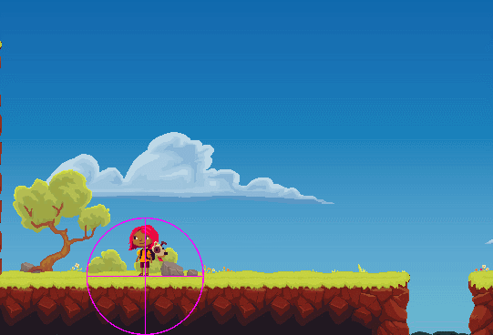

# Explanation PhysicsObject

## 무엇을 하려고 하는가?

* How-to-guide PhysicsObject에서는 코드의 흐름을 단계적으로 나눴다면 이 페이지 에서는 단계적으로 나눈 Code Block들에 대한 설명과 전반지식에 대한 설명을 합니다.
* 설명에 대한 함수 설명과 사용법들은 아래의 기술문서 링크를 타고 보실수 있습니다.
* 아래의 글들은 영상을보고 정리한 것이니 일부의 오류가 있을 수도 있습니다. 이러한 부분에서는         오류를 수정 발견 및 수정을 원하신다면 이메일로 지적해 주신다면 확인 및 수정절차에                            들어가겠습니다.
* 보다 쉽게 설명한 예가 있어서 링크한 URL 들에 대해 상업적 목적이 없다는 뜻을 미리 알립니다.


[tr-physicsobject.md](../../technical-reference/unity/tr-physicsobject.md)


## Scripting Gravity

중력을 적용하는 과정입니다.

중력을 적용하기 위해서 Unity에 미리 선언되어 있는 Physics2D.gravity 변수를 이용하여 velocity라는 Vector2 변수에 연산을 하여 낙하 속도 연산을 Time.deltaTime을 곱하여 이전 프레임이 완료된 시간을 곱합니다.


Time.deltaTime은 이전 프레임이 완료된 시간을 의미하며, 단위는 초(s)단위 입니다.

각기 다른 사양의 컴퓨터에서의 어떤 기능을 동기화 시키기 위해 사용하는데, 해당 프로젝트에서는 아무리 낮은 FPS를 가진 컴퓨터라도, 이전 프레임이 완료된 시간을 곱하여, 프레임당 이동거리를 초당 거리로 바꿔주는 역할을 합니다.


그 후 새로운 Vector2 변수를 통해 Object에 적용될 새로운 Position변수를 생성하고, velocity \* Time.deltaTime을 통해, 플레이어가 움직일 수 있는 x축을 제외한 y축의 값을 고정시켜 줍니다.


이때 고정된 값에 따라 일정 간격으로 호출하는 Unity Framework의 FixedUpdate()함수를 사용하여 해당 연산을 합니다.

이유는 Update() 함수로 호출 시 제대로 물리 충돌에 관한 연산이 이루어지지 않을 가능성이 있기 때문입니다.


```csharp
Vector2 velocity;
void FixedUpdate()
{
    velocity += gravitymodifier * Physics2D.gravity * Time.deltaTime;
    Vector2 deltaPosition = velocity * Time.deltaTime;
    Vector2 move = Vector2.up * deltaPosition.y;
    Movement(move)
}
```

이제 실질적으로 Object를 이동하는 함수인 Movement()를 작성하는데 간단하게 Rigidbody2D의 Position을 가져와 parameter로 받은 변수를 계속 더해줍니다.

```csharp
void Movement(Vector2 move)
{
    rb2d.position = rb2d.position + move
}
```

## Detecting Overlaps

위에서 중력을 적용하고 움직임을 부여 했지만 그 움직임은 기본적으로 중력을 적용하기 위한 움직임이지 PlayerStart가 움직이기 위한 움직임은 아닙니다. PlayerStart가 움직이기 위해서는  여러 작업이 필요합니다. 그 중에 이 단락에서는 충돌체가 겹치는지 안겹치는지 확인하기 위한 작업을 합니다.

핵심적으로는 Rigidbody2D.cast라는 함수가 존재합니다. 이 함수를 이용하여 충돌체를 반환하고 결과를     int형 배열에 저장 하는 기능을 가진 함수인데 이것을 가지고 충돌을 감지하는 이 단락에서 핵심 기능입니다.


int count = rb2d.Cast(move, contactFilter, hitBuffer, distance + shellRadius);

위와 같은 parameter를 가지고 그 결과를 int형 배열로 반환하기 때문에 int형 변수에                   저장합니다.

Rigidbody2D는 Collider와 암시적으로 연결되기 때문에, contactFilter에 설정된 Layer에서, distance + shellRadius만큼의 거리를 move 방향으로 투사하여 부딪힌 모든 것들을 반환합니다.

이를 최종적으로 int형 변수에 부딪힌 것들의 갯수를 반환합니다.

hitBuffer의 공간은 최대 RayCastHit 배열의 16칸으로 부딪힌 것들을 최대 16개 반환 할 수 있다는 의미입니다.


&#x20;이 기능을 사용하기 위해서는 RayCastHit2D, ContactFilter2D Component가 필요한데 각각 아래의 기능을 가지고 있습니다.

* RayCastHit2D : 2D physics에서 RayCast(광선을 따라 놓여 있는 물체를 감지하기 위해 사용)에 의해           감지된 물체에 대한 정보를 반환합니다.
* ContactFilter2D : 접촉한 물체에 대한 정보를 반환합니다. ContactFilter를 사용한다면 접촉 결과를 나중에 필터링 할 필요없이 더 빠르고 편리하게 사용 가능합니다.



## Scripting Collision

&#x20;위에서는 충돌을 감지하는 기능이 대부분 이였다면 여기서는 직접 충돌에 관한 처리를 Scripting을 합니다.&#x20;

원래는 Physics.RayCast() 함수를 통해 어떤 정점에서 광선을 일정거리만큼 쏴서 걸린 모든 충돌체를 반환하는 형식을 사용하지만 여기서는 RayCastHit2D List를 가지고 놓여진 물체들을 List형식으로 관리합니다.

그렇다면 충돌체를 어떻게 RayCastHit List에 넣을것인가에 대한 의문이 들 수 있는데 해당 프로젝트에서는이미 Count 변수로 Ribidbody2D에 걸린 물체들의 갯수를 반환하기 때문에, for문을 사용하여 충돌된 물체들을 List에 추가합니다.

그리고 충돌체의 법선벡터(normal Vector)인 currentNormal변수를 선언해서 List에 있는 충돌체들에 대한 법선 벡터를 선언합니다.

후에 선언한 minGroundNormalY의 값과 비교하여 땅인지 아닌지를 판별하고 yMovement가 true, 즉 점프 하는 중이라면, 땅일때의 플레이어가 움직일 Vector인 groundNormal은 currentNormal이 되고 currentNormal.x의 값을 0으로 만듭니다.

```csharp
void Movement(Vector2 move, bool yMovement)
    {
        float distance = move.magnitude;
        if (distance > minMoveDistance)
        {
            int count = rb2d.Cast(move, contact, hitBuffer, distance + shellRadius);
            hitBufferList.Clear();

            for(int i=0; i<count; i++)
            {
                hitBufferList.Add(hitBuffer[i]);
            }

            for(int i=0; i<hitBufferList.Count; i++)
            {
                Vector2 currentNormal = hitBufferList[i].normal;
                if(currentNormal.y > minGroundNormalY)
                {
                    grounded = true;
                    if(yMovement)
                    {
                        groundNormal = currentNormal;
                        currentNormal.x = 0;
                    }
                }
            }
        }
        
        rb2d.position = rb2d.position + move;
    }
```


왜 normal Vector끼리의 비교가 필요한가에 대한 설명을 하자면, rb2d.cast()함수로 move라는 방향으로 부딪힌 물체를 반환하는데 아직까지 move 변수에는 중력을 적용하는 연산만 적용했기 때문에, 아래쪽 방향으로 움직이는 와중에 어떤 Tile에 걸린다면, 해당 Tile의 수직인 벡터를 반환합니다.

즉, 수직인 법선벡터는 캐릭터가 땅에 서있는가를 판별하는데 좋은 역할을 하기 때문에, 공중인지 아닌지를 판별하기 위해 비교를 합니다.


.png>)

땅인지 아닌지를 판별했다면, 그 다음으로 velocity와 currentNormal의 내적을 구하여, projection이라는 변수에 담습니다. projection은 다음과 같은 경우의 수로 움직입니다.

* velocity와 currentNormal이 같은 방향(여기서는 추락중이니 아래쪽)이라면 1
* 서로 반대방향이라면 -1
* 그 사이값이라면 연산되고 있는 법선벡터의&#x20;

만약 Projection이 0 이하라면 서로 반대방향이기 때문에, 중력과 반대방향으로 힘을 줘야할 필요가 있기 때문에, 해당 연산을 구현합니다.

```csharp
float projection = Vector2.Dot(velocity, currentNormal);
if(projection < 0)
{
    velocity = velocity - projection * currentNormal;
}
```

최종적으로 Rigidbody2D.Cast()를 통해 Object에서 일정 거리가 떨어져 있는 탐색 알고리즘을 구현했기 때문에, 만약 캐릭터가 장애물에 부딪힐 때의 속도를 구현합니다.

```csharp
float modifiedDistance = hitBufferList[i].distance - shellRadius;
distance = modifiedDistance < distance ? modifiedDistance : distance;
```

## Horizontal Movement

새로이 ComputeVelocity()라는 함수와 기존에 쓰지 않았던 moveAlongGround라는 Vector2변수가               등장합니다. 각각 앞의 함수는 다른 Script에서 지금 작업중인 Script를 상속받아 쓰기 위함이고, 뒤의 변수는  땅에 수직인 Vector2를 구하기 위함입니다. 앞의 함수를 상속받는 것은 기능을 분할 시키기 위함이라고 쳐도 뒤에 moveAlongGround라는 변수가 왜 필요한지 보면 아래의 링크의 원문을 보고 이해했습니다.


2D 평면에서 정상(수직) 벡터를 찾는 이유


즉, 어떤 공간에서 두 지점은 같은 공간을 공유하지만 반대 방향을 가리키는 두 개의 평면이 실제로 지나가고 있기 때문에 두 지점에서 정상적으로 계산하려면 먼저 방향 벡터(vector2.dot)를 확보한 다음 양쪽으로 90도 회전해야 하기 때문입니다.

{% embed url="https://ddomyangggung.tistory.com/entry/%EA%B3%A0%EB%8F%84%EC%97%94%EC%A7%84-%ED%8A%9C%ED%86%A0%EB%A6%AC%EC%96%BC-17-%EB%B2%A1%ED%84%B0-%EC%88%98%ED%95%99Vector-math" %}
2D 평면에서의 정상(수직)벡터를 찾는 이유2


위와 같은 이유로 moveAlongGround라는 변수는 2D 평면상에서 정상적으로 계산하기 위한 절차라고        이해했습니다.

이미 yMovement의 값에 따라 groundNormal을 currentNormal로 구현했기 때문에, 이를 x, y값을 Swap후 하나를 부정하는 형식으로 구현하면, 땅과 평행선인 벡터를 구할 수 있기 때문에, moveAlongGround와 deltaPosition.x값을 곱하여 새로운 Vector로 정의합니다.

## Player Controller Script

PhysicsObject.cs에서는 충돌에 관한 기능들을 만들었다면 PlayerPlatformerController.cs에서는 실질적으로 움직이기 위한 Script로 기능을 나눕니다.

PlayerPlatformerController.cs에서는 기존 PhysicsObject.cs의 기능들을 상속받아서 씁니다. 그렇기 때문에 길게 어떠한 기능들에 대해서 작성하는 것도 아니며, 이미 Unity에 내장되어 있는 기능들을 활용합니다.


move.x = Input.GetAxis("Horizontal");

위의 GetAxis기능은 따로 기능에 관해서 설명하진 않겠습니다. 기존 Unity Document 및 Google에 검색만 하면 해당 글보다 좀 더 자세하게 얻을 수 있으며, 제가 정보를 얻은 글에 대한 링크는 아래에 남기겠습니다.&#x20;

그러니 여기서는 그냥 모니터를 보는 시선을 기준으로 하여 좌우를 눌렀을 때 -1 \~ 1의 값을 가지고 입력이 없을시에는  0의 값을 가지며 독립적인 프레임속도를 가지기 때문에 이 기능이 사용시 프레임의 속도 변화량에 따른 문제를 고민하지 않아도 된다는 것입니다.

[https://docs.unity3d.com/kr/530/ScriptReference/Input.GetAxis.html](https://docs.unity3d.com/kr/530/ScriptReference/Input.GetAxis.html)


그리고 Jump Button을 눌렀을 시에 velocity.y = jumpTakeOffSpeed  즉, PhysicsObject.cs에서 쓰인 velocity변수가 중력의 영향을 받아 0이하로 떨어지게 되고 이는 물체가 낙하한다는 것을 의미하니까 위의 문법은 velocity.y에 7의 힘을 주겠다는 의미이고 아래의 else if문에서 velocity.y > 0일때 0.5씩 곱하여 매 프레임마다 중력기능과 같이 적용하여 점프하는 기능을 작성한다는 뜻으로 보입니다.

결국 최종적인 PlayerStart에 대한 속도는 targetVelocity = move \* maxSpeed의 문법으로  확정짓게 됩니다.

## Adding Player Animation

이 단락에서는 Animation, PlayerStart가 움직이는 것처럼 보이는 방법에 대하여 설명하고 있습니다.

Unity에서의 Animation은 Animator를 가지고 있으며 이는 Inspector에서 따로 Animator Component를 추가해야 합니다. 그러나 이 예제에서는 기본적으로 추가가 되어있기 때문에 좀더 깊게 들어가는 설명은 하지   않고 따로 기술문서에서 다루겠습니다.

그리고 SpriteRenderer는 기본적으로 Object가 추가 될 때 보여지는 형체이기 때문

첫 단락 Scripting Gravity에서 했던 것처럼 Component를 가져와야 합니다. GetComponent로 Animator와 SpriteRenderer를 가져와서 ComputeVelocity() 함수에서 GetAxis를 통해 수평적인(Horizontal) 움직임을 보였을 때 반환되는 값을 가지고 0을 기준으로 하여 양수, 음수의 값을 가진다면 움직임(오른쪽 혹은 왼쪽)을 보인다는 것이니 그 값에 따라 Flip해줍니다.&#x20;

그리고 Animator에서는 특정 변수의 값에 따라 해당 Animation을 실행하는 parameter가 있습니다. 이번 예제에서는 bool, float 변수의 통제를 통해 미리  설정한 조건이 참일 시 실행하도록 코딩했습니다.

## 마치며

* 이상으로 해설 문서를 마치겠습니다.
* 각 해설에 따른 기술적인 문서는 아래의 링크에 기재했습니다.


[tr-physicsobject.md](../../technical-reference/unity/tr-physicsobject.md)


사실 CharacterController라는 기능을 써서 처리하는 것이 코딩하는데 있어서 더 편하거나 강의 영상의 코딩보다 효율적일 수 있습니다. 하지만 Collision Scripting을 통해서 많은 것을 얻을 수 있었고, 엔진의 이해가 좀더 쉽게 된다는 점이 장점으로써 크게 와닿았습니다.

