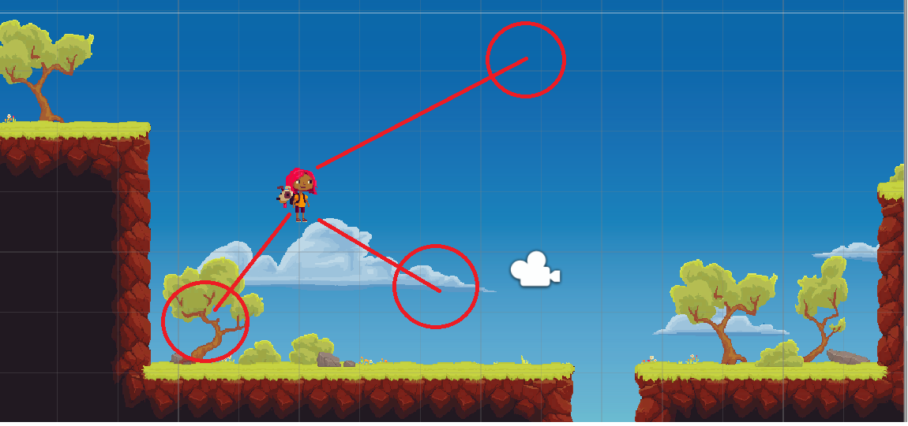

# TR PhysicsObject

## 시작하기에 앞서 몇가지 주의해야 할 점들

* 해당 글에 대한 기술적인 문서들은 Document 혹은 타 기술Blog에서 가져온 것이며 이것을 가지고 어떠한 수입창출을 내지 않습니다.
* 일부 Document에 대한 글은 정보의 부족 혹은 원서 번역을 통해 나름대로 번역한것 입니다. 일부 곡해된 단어나 뜻이 들어갈 수 있기 때문에 이는 아래의 e-mail을 통해 오류를 범한 부분을 보내주시면 확인 후 수정작업에 들어가도록 하겠습니다.

## Scripting Gravity

이 단락에서는 아래와 같은 기술문서를 다루고 있습니다.

* Rigidbody2D.cast


Rigidbody2D.Cast Document


두 종류의 Rigidbody2D.cast 함수가 존재합니다. 각각 아래의 parameter를 가지고 있습니다.

1. public int Cast([Vector2](https://docs.unity3d.com/ScriptReference/Vector2.html) direction, RaycastHit2D\[] results, float distance = Mathf.Infinity);
2. public int Cast([Vector2](https://docs.unity3d.com/ScriptReference/Vector2.html) direction, [ContactFilter2D](https://docs.unity3d.com/ScriptReference/ContactFilter2D.html) contactFilter, List\<RaycastHit2D> results, float distance = Mathf.Infinity);



All the [Collider2D](https://docs.unity3d.com/ScriptReference/Collider2D.html) shapes attached to the [Rigidbody2D](https://docs.unity3d.com/ScriptReference/Rigidbody2D.html) are cast into the Scene starting at each Collider position ignoring the Colliders attached to the same [Rigidbody2D](https://docs.unity3d.com/ScriptReference/Rigidbody2D.html).

**Rigidbody2D에 부착된 모든 Collider2D 형상은 Scene이 시작될 때 동일한 Rigidbody2D에 부착된 충돌체를 무시하고 각 충돌체 위치에서 만들어집니다.**

This function will take all the [Collider2D](https://docs.unity3d.com/ScriptReference/Collider2D.html) shapes attached to the [Rigidbody2D](https://docs.unity3d.com/ScriptReference/Rigidbody2D.html) and cast them into the Scene starting at the Collider position in the specified `direction` for an optional `distance` and return the results in the provided `results` array.

**이 함수의 기능은 Rigidbody2D에 부착된 모든 Collider2D의 모양을 가져와서 선택적인 distance변수, 지정된 direction변수 방향으로 Collider위치에서 시작하여 Scene에 Cast하고 제공된 결과배열로 result를 반환합니다.**\
\
The integer return value is the number of results written into the `results` array. The results array will not be resized if it doesn't contain enough elements to report all the results. The significance of this is that no memory is allocated for the results and so garbage collection performance is improved when casts are performed frequently.

**정수 반환 값은 result array에 기록된 결과의 수입니다. 모든 결과를 보고하기에 충분한 요소가 포함되어 있지 않으면 result array의 크기가 조정되지 않습니다. 그 중요성은 결과에 메모리가 할당되지 않기 때문에 자주 cast를 수행할 때 가비지 수집 성능이 향상된다는 점에 있습니다.**

\
Additionally, this will also detect other Collider(s) overlapping the collider start position. In this case the cast shape will be starting inside the Collider and may not intersect the Collider surface. This means that the collision normal cannot be calculated in which case the collision normal returned is set to the inverse of the `direction` vector being tested.

**또한, 이것은 Collider 시작 위치와 겹치는 다른 Collider도 탐지합니다. 이 경우 cast shape은 충돌기 내부에서 시작되고 Collider 표면을 교차하지 않을 수 있다. 즉, 충돌 정상값이 시험 중인 방향 벡터의 역방향으로 설정된 경우 충돌 정상값을 계산할 수 없다.**



paramter 1과 같지만 아래와 같은 추가 기능이 있습니다.

&#x20;The `contactFilter` parameter can filter the returned results by the options in [ContactFilter2D](https://docs.unity3d.com/ScriptReference/ContactFilter2D.html).

ContactFilter 매개변수는 ContactFilter2D의 옵션에 의해 반환된 결과를 필터링할 수 있습니다.\




**즉, Object의 Rigidbody에 붙은 Collider의 모양을 가져와서 설정한 방향으로 Collider 위치에서 일정한 거리만큼의 RayCast, 광선을 쏴서 걸리는 물체들을 배열로 반환한다는 의미인듯 합니다. 충돌을 감지하거나, 충돌에 대한 어떤 처리를 위해 필요한 함수 인듯합니다.**

## Detecting Overlaps

이 단락에서는 아래와 같은 기술문서를 다루고 있습니다.

* ContactFilter2D
* RayCastHit2D


ContactFilter2D Document




A set of parameters for filtering contact results.

접촉한 결과물을 필터링하기 위한 매개 변수 집합입니다.

Use a contact filter to precisely control which contact results get returned. This removes the need to filter the results later, is faster, and more convenient.

어떤 접촉한 결과물이 반환되는지 정확하게 제어하려면 ContactFilter를 사용하십시오. 이렇게 하면 나중에 접촉한 결과물을 필터링할 필요가 없어지고, 더 빠르고, 더 편리해집니다.

&#x20;If you are using a function that requires a [ContactFilter2D](https://docs.unity3d.com/ScriptReference/ContactFilter2D.html), but you don't want to perform any filtering, then use [ContactFilter2D.NoFilter](https://docs.unity3d.com/ScriptReference/ContactFilter2D.NoFilter.html).

ContactFilter2D가 필요한 기능을 사용하고 있지만 필터링을 수행하지 않으려면 ContactFilter2D.NoFilter를 사용하시면 됩니다.



Information returned about an object detected by a raycast in 2D physics.

2D physics에서는 레이캐스트에 의해 감지된 물체에 대한 정보를 반환합니다.

&#x20;A _raycast_ is used to detect objects that lie along the path of a _ray_ and is conceptually like firing a laser beam into the scene and observing which objects are hit by it. The RaycastHit2D class is used by [Physics2D.Raycast](https://docs.unity3d.com/kr/530/ScriptReference/Physics2D.Raycast.html) and other functions to return information about the objects detected by raycasts.

레이캐스트는 광선의 경로를 따라 놓여 있는 물체를 감지하기 위해 사용되며 개념적으로 레이저 빔을 현장으로 발사하여 어떤 물체가 부딪히는지 관찰하는 것과 같습니다. RaycastHit2D 클래스는 Physical2D.RayCast에 의해 사용되고 raycasts 및 기타 기능을 통해 레이캐스트에서 탐지된 물체에 대한 정보를 반환할 수 있습니다.



&#x20; ContactFilter2D 기능은 Rigidbody2D.cast의 parameter로써 필요하지만 기본적으로 접촉한 결과물, 즉&#x20;

## Scripting Collision

이 단락에서는 아래와 같은 기술문서를 다루고 있습니다.

* Vector
* normal Vector
* Vector2.Dot



Vector에 관한 개념적인 이야기는 잘 설명되어 있는 글이 많고 여기서 정리하는 것이 그것보다 좋진 않기 때문에 굳이 여기서 하지 않겠습니다.

여기서 설명드릴 Vector에 관한 이야기는 이 강의 영상을 보면서 정리한 글이니, 참고바랍니다.

Scripting Gravity에서의 한 문장을 가지고 예시를 들겠습니다.                                                                          `velocity + gravityModifier Physics2D.gravity Time.deltaTime;`

Vector2 = (x, y) 값을 이용하여 Position(위치)를 지정함과 동시에 가산연산자(+=)를 통해 매 프레임마다 움직일 수 있도록 연산을 합니다. 위의 중력을 부여하는데도 이와 같은 원리를 적용합니다. 물론 위치뿐만이 아니라 길이를 가지고 있는 것이 Vector변수 이기 때문에 Vector.magnitude()함수를 가지고 Vector의 길를 구할 수 있습니다. 자세한 내용은 구글링 혹은 아래의 링크를 보시면 되겠습니다.


Vector2 Document





Vector에 관한 이야기가 정리가 되셨다면                                                                                                            _**왜 normal Vector(법선 벡터 or 수직 벡터)라는 변수를 구하여 적용시켜야 하는가?**_ 에 관해서             설명하겠습니다.

groundNormal 이라는 변수를 통해 RaycastHit2D.normal(광선에 부딪힌 물체의 법선벡터)를 구해야 PlayerStart가** 땅위에 서있는지 판별 할 수 있기 때문**입니다.

기본적으로 Unity는 엄지 : X축, 검지 : Y축, 중지 : Z축으로 왼손 좌표계를 기준으로 합니다.&#x20;

.png>)

이러한 좌표계를 가지고 어떤 Object를 중심으로 로컬, 월드 좌표계로 나누고, 상대적이냐, 절대적이냐를 따지는데 Collider가 충돌 시 RayCastHit2D를 사용하여 광선을 쏴서 부딪힌 물체의 법선벡터를 구하여 표면에 수직인 경우 양수를 반환합니다.

그리고 **면의 앞뒤를 구분하는데 있어서 유용하기 때문입니다**. 만약 음수를 반환한다면 물체의 안쪽에 있는 것으로 판별이 되어 그만큼의 렌더링을 해야하고 이는 성능 저하 및 Light연산과 밀접하게 관련이 있습니다. 어차피 2D게임이기 때문에 Light관해서는 크게 신경을 쓰지 않으셔도 괜찮습니다만 3D게임으로 넘어가면 Lighting 연산은 필수적으로 신경써야하는 부분이기 때문에 기술문서에 넣었습니다.



normal Vector를 구하는 이유에 관해서 이해가 가셨다면 Vector2.Dot(), 즉 내적에 관한 이야기를     하겠습니다.&#x20;

내적이란 쉽게 말하면 임의의 Vector A, B 가 있다면 A, B의 각 성분을 무언가를 쉽게 비교하기 위한 값으로 바꿔주는 정규화 과정을 통하여 치환 후, 단위벡터로 바꿉니다. 그렇게 된다면 두 단위벡터는 결국 1, 혹은 -1의 값을 가지게 됩니다.

그렇게 된다면 Vector2.Dot 내부적으로 반환값을 가지고 방향을 판별할 수 있게 됩니다. Vector의 Dot Product의 값을 구하는데는 또 한가지 방법이 있는데 이는, 임의의 두 Vector변수의 각 성분들 끼리 곱하여 더한 값으로 값을 구할 수 있습니다.

정리를 하자면 아래와 같습니다.

1. 어떤 한 Object에서 RaycastHit2D를 통해 충돌체를 감지 한다는 것은 알겠는데 그 물체가                 도대체 어디쯤에 위치한 것인가를 파악해야한다. 그래서 Vector를 이용하여 구한다.
2. normal Vector를 통하여 표면에 수직인 Vector를 구한다면 해당 normal Vector와 어떤 물체가 위치하여 있는 Vector의 내적을 통해 어디쯤 위치해 있는지 구할 수 있을 것이다. 왜냐하면 Vector는 Position의 성질도 같이 가지고 있기 때문이다.
3. 이를 위해 RaycastHit2D의 normal Vector를 통해 표면에 수직인 Vector와 물체가 움직이기 위해 만든 velocity를 통해 Dot Product를 통하여 projection, 즉 사영공간을 구한다. 굳이 velocity라는 중력작용 변수를 통하여 움직이는 이유는 어차피 velocity라는 변수는 해당 Object에만 적용 시키기 때문이다. 그렇기 때문에 물체에 기준이 되는 Vector라고 볼수 있기 때문이다.



## Horizontal Movement

이 단락에서는 아래와 같은 기술문서를 다루고 있습니다.

* moveAlongGround의 의미



사실 moveAlongGround 변수를 통해 Vector2 끼리의 Swap이 일어나지 않아도 정상적인 움직임을 보입니다. 하지만 경사면 위에 있을 때 Character는 움직이는 것으로 간주되어 Run의 움직임을             보이게 됩니다.

이런 이유를 보이는 까닭은 경사면을 조사할 때 RaycastHit2D.normal(법선벡터)을 조사해서 Rigidbody2D.position으로 움직이는데 이때 velocity.x가 초기화 되지않기 때문입니다.

또한 절벽으로 떨어질 때 벽에 붙어버리면 벽을 타고 올라가는 현상이 발생합니다. 이 현상은 normal Vector에 대한 처리를 안할시 발생합니다.&#x20;


Vector2 moveAlongGround = new Vector2(groundNormal.y, -groundNormal.x);

Vector2 move = moveAlongGround \* deltaPosition.x;


위와 같은 코드를 거쳐 deltaPosition에 관한 예외처리를 해줍니다. 위와 같은 작업을 거치면 normal Vector(법선벡터)에 parameter를 바꿔서 perpendicular Vector(법선벡터의 수직 벡터)를 구할 수 있습니다.

즉, 어떤 물체의 법선벡터의 수직벡터를 구하면 어차피 -1\~1값이 나오니, 이 값을 deltaPosition.x에 곱연산을 해서 땅인지 아닌지를 판별한다. 땅이라면 (1,0) or (-1,0)이 나올것이고 경사면이라면                                                            (-1 \~ 1, -1 \~ 1) 사이의 값이 나오니까 경사면을 판별 가능하다.


