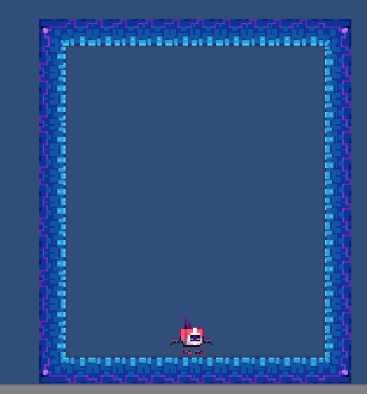

# tutorial Celeste's Movement

## 무엇을 하려고 하는가?

* 유명 인디게임 Celeste의 움직임을 모방합니다.
* 기존의 Velocity로 움직이던 Jump의 보완하는 새로운 Script 작성합니다.
* 외부 API인 DOTween을 사용하여 카메라에 RippleEffect를 적용합니다.
* 동일하게 GhostTrail이라는 Script를 사용하여 Character가 움직이면서 나타나는 Effect를 적용합니다.
* Collision을 Gizmo를 사용하여 Editor상에서 편집하기 쉽게 작성합니다.
* Particle System을 이용한 Effect 적용을 연습합니다.


* 아래의 영상을 통해 어떠한 수익창출도 이루어 지지 않고 오직 학습한 내용을 공유하는 목적에 있다는 것을 알립니다.
  * The video below indicates that no revenue is generated.  It only informs the purpose of sharing what they have learned.
* 잘못된 내용이나 수정할 점이 있으면 page guide에 있는 이메일로 해당 내용을 보내주시면 수정작업에 들어가도록 하겠습니다.

## 왜 하려고 하는가?

* 외부에서 여러가지 효과를 쉽게 적용하기 위한 API소개와 Particle System을 이용한 Effect 적용을 학습합니다.
* 기존의 Tilemap을 이용하여 Map Design을 하기 때문에 연속적인 학습효과 기대 할 수 있습니다.
* 아래의 링크에 강의 영상을 첨부했습니다.


Create Celeste's Movement Video



Celeste's Movement Github



## 작성법

임의의 Project를 하나 생성 합니다. 그리고 Tilemap Object를 하나 생성합니다. 그 후 이전 tutorial인 Tilemap을 활용하여 임의의 Map Design을 만듭니다.

.png>)

위 그림은 위에서 첨부한 Github에 등재된 Palette 기준으로 작성했습니다.

Map Design이 갖춰졌다면 이를 바탕으로 Character Object, Tilemap 충돌처리를 작성 하겠습니다.

Tilemap에 Rigidbody2D와 Tilemap Collider 2D, Composite Collider 2D Component를 추가하여 작성합니다. **이때 Rigidbody2D는 Body Type이 Static으로 설정**하여 충돌은 주되 힘의 영향을 받지 않도록 설정합니다.&#x20;

그리고 Character Object에는 Capsule Collider 2D, Rigidbody2D Component를 추가합니다. 아래의 그림에서는 첨부한 Github의 Asset Sprite를 사용하여 Sprite를 사용하였으며 굳이 그림의 Sprite가 아닌 다른 Sprite를 사용해도 무방합니다.

.png>)

Character Object에 대한 작업을 하기 전에 Character Object의 하위 Object를 만들어서 따로 관리 하도록 합니다. 아래의 그림과 같이 Empty Object를 생성하여 Hierarchy를 만듭니다.

.png>)

이렇게 관리하는 이유는 작업하는데 있어서 확실하게 구분하기 위함이라고 봅니다. Character, Visual, Particle등 각 항목을 세분화 하고 수정하는데 있어서 시간이 단축됩니다.

* Character Object : 움직임, 충돌처리의 시각화, 시각화를 바탕으로 한 충돌처리
* Visual Object : Sprite Renderer와 Animator를 통한 Animation Clip 재생
* Particle : Character Object에 쓰일 Particle System Component

Character Object에는 Movement, BetterJumping, Collision Script를 넣고 Visual Object에는 Animator Component와 AnimationScript를 넣습니다.




```csharp
using System;
using System.Collections;
using System.Collections.Generic;
using UnityEngine;
using DG.Tweening;

public class Movement : MonoBehaviour
{
    private Collision coll;
    [HideInInspector]
    public Rigidbody2D rb;
    private AnimationScript anim;

    [Space]
    [Header("Stats")]
    public float speed = 10;
    public float jumpForce = 50;
    public float slideSpeed = 5;
    public float wallJumpLerp = 10;
    public float dashSpeed = 20;

    [Space]
    [Header("Booleans")]
    public bool canMove;
    public bool wallGrab;
    public bool wallJumped;
    public bool wallSlide;
    public bool isDashing;

    [Space]

    private bool groundTouch;
    private bool hasDashed;

    public int side = 1;

    [Space]
    [Header("Polish")]
    public ParticleSystem dashParticle;
    public ParticleSystem jumpParticle;
    public ParticleSystem wallJumpParticle;
    public ParticleSystem slideParticle;

    // Start is called before the first frame update
    void Start()
    {
        coll = GetComponent<Collision>();
        rb = GetComponent<Rigidbody2D>();
        anim = GetComponentInChildren<AnimationScript>();
    }

    // Update is called once per frame
    void Update()
    {
        float x = Input.GetAxis("Horizontal");
        float y = Input.GetAxis("Vertical");
        float xRaw = Input.GetAxisRaw("Horizontal");
        float yRaw = Input.GetAxisRaw("Vertical");
        Vector2 dir = new Vector2(x, y);

        Walk(dir);
        anim.SetHorizontalMovement(x, y, rb.velocity.y);

        if (coll.onWall && Input.GetButton("Fire3") && canMove)
        {
            if(side != coll.wallSide)
                anim.Flip(side*-1);
            wallGrab = true;
            wallSlide = false;
        }

        if (Input.GetButtonUp("Fire3") || !coll.onWall || !canMove)
        {
            wallGrab = false;
            wallSlide = false;
        }

        if (coll.onGround && !isDashing)
        {
            wallJumped = false;
            GetComponent<BetterJumping>().enabled = true;
        }
        
        if (wallGrab && !isDashing)
        {
            rb.gravityScale = 0;
            if(x > .2f || x < -.2f)
            rb.velocity = new Vector2(rb.velocity.x, 0);

            float speedModifier = y > 0 ? .5f : 1;

            rb.velocity = new Vector2(rb.velocity.x, y * (speed * speedModifier));
        }
        else
        {
            rb.gravityScale = 3;
        }

        if(coll.onWall && !coll.onGround)
        {
            if (x != 0 && !wallGrab)
            {
                wallSlide = true;
                WallSlide();
            }
        }

        if (!coll.onWall || coll.onGround)
            wallSlide = false;

        if (Input.GetButtonDown("Jump"))
        {
            anim.SetTrigger("jump");

            if (coll.onGround)
                Jump(Vector2.up, false);
            if (coll.onWall && !coll.onGround)
                WallJump();
        }

        if (Input.GetButtonDown("Fire1") && !hasDashed)
        {
            if(xRaw != 0 || yRaw != 0)
                Dash(xRaw, yRaw);
        }

        if (coll.onGround && !groundTouch)
        {
            GroundTouch();
            groundTouch = true;
        }

        if(!coll.onGround && groundTouch)
        {
            groundTouch = false;
        }

        WallParticle(y);

        if (wallGrab || wallSlide || !canMove)
            return;

        if(x > 0)
        {
            side = 1;
            anim.Flip(side);
        }
        if (x < 0)
        {
            side = -1;
            anim.Flip(side);
        }


    }

    void GroundTouch()
    {
        hasDashed = false;
        isDashing = false;

        side = anim.sr.flipX ? -1 : 1;

        jumpParticle.Play();
    }

    private void Dash(float x, float y)
    {
        Camera.main.transform.DOComplete();
        Camera.main.transform.DOShakePosition(.2f, .5f, 14, 90, false, true);
        FindObjectOfType<RippleEffect>().Emit(Camera.main.WorldToViewportPoint(transform.position));

        hasDashed = true;

        anim.SetTrigger("dash");

        rb.velocity = Vector2.zero;
        Vector2 dir = new Vector2(x, y);

        rb.velocity += dir.normalized * dashSpeed;
        StartCoroutine(DashWait());
    }

    IEnumerator DashWait()
    {
        FindObjectOfType<GhostTrail>().ShowGhost();
        StartCoroutine(GroundDash());
        DOVirtual.Float(14, 0, .8f, RigidbodyDrag);

        dashParticle.Play();
        rb.gravityScale = 0;
        GetComponent<BetterJumping>().enabled = false;
        wallJumped = true;
        isDashing = true;

        yield return new WaitForSeconds(.3f);

        dashParticle.Stop();
        rb.gravityScale = 3;
        GetComponent<BetterJumping>().enabled = true;
        wallJumped = false;
        isDashing = false;
    }

    IEnumerator GroundDash()
    {
        yield return new WaitForSeconds(.15f);
        if (coll.onGround)
            hasDashed = false;
    }

    private void WallJump()
    {
        if ((side == 1 && coll.onRightWall) || side == -1 && !coll.onRightWall)
        {
            side *= -1;
            anim.Flip(side);
        }

        StopCoroutine(DisableMovement(0));
        StartCoroutine(DisableMovement(.1f));

        Vector2 wallDir = coll.onRightWall ? Vector2.left : Vector2.right;

        Jump((Vector2.up / 1.5f + wallDir / 1.5f), true);

        wallJumped = true;
    }

    private void WallSlide()
    {
        if(coll.wallSide != side)
         anim.Flip(side * -1);

        if (!canMove)
            return;

        bool pushingWall = false;
        if((rb.velocity.x > 0 && coll.onRightWall) || (rb.velocity.x < 0 && coll.onLeftWall))
        {
            pushingWall = true;
        }
        float push = pushingWall ? 0 : rb.velocity.x;

        rb.velocity = new Vector2(push, -slideSpeed);
    }

    private void Walk(Vector2 dir)
    {
        if (!canMove)
            return;

        if (wallGrab)
            return;

        if (!wallJumped)
        {
            rb.velocity = new Vector2(dir.x * speed, rb.velocity.y);
        }
        else
        {
            rb.velocity = Vector2.Lerp(rb.velocity, (new Vector2(dir.x * speed, rb.velocity.y)), wallJumpLerp * Time.deltaTime);
        }
    }

    private void Jump(Vector2 dir, bool wall)
    {
        slideParticle.transform.parent.localScale = new Vector3(ParticleSide(), 1, 1);
        ParticleSystem particle = wall ? wallJumpParticle : jumpParticle;

        rb.velocity = new Vector2(rb.velocity.x, 0);
        rb.velocity += dir * jumpForce;

        particle.Play();
    }

    IEnumerator DisableMovement(float time)
    {
        canMove = false;
        yield return new WaitForSeconds(time);
        canMove = true;
    }

    void RigidbodyDrag(float x)
    {
        rb.drag = x;
    }

    void WallParticle(float vertical)
    {
        var main = slideParticle.main;

        if (wallSlide || (wallGrab && vertical < 0))
        {
            slideParticle.transform.parent.localScale = new Vector3(ParticleSide(), 1, 1);
            main.startColor = Color.white;
        }
        else
        {
            main.startColor = Color.clear;
        }
    }

    int ParticleSide()
    {
        int particleSide = coll.onRightWall ? 1 : -1;
        return particleSide;
    }
}
```





```csharp
  
using System.Collections;
using System.Collections.Generic;
using UnityEngine;

public class BetterJumping : MonoBehaviour
{
    private Rigidbody2D rb;
    public float fallMultiplier = 2.5f;
    public float lowJumpMultiplier = 2f;

    void Start()
    {
        rb = GetComponent<Rigidbody2D>();
    }

    void Update()
    {
        if(rb.velocity.y < 0)
        {
            rb.velocity += Vector2.up * Physics2D.gravity.y * (fallMultiplier - 1) * Time.deltaTime;
        }else if(rb.velocity.y > 0 && !Input.GetButton("Jump"))
        {
            rb.velocity += Vector2.up * Physics2D.gravity.y * (lowJumpMultiplier - 1) * Time.deltaTime;
        }
    }
}
```





```csharp
using System.Collections;
using System.Collections.Generic;
using UnityEngine;

public class Collision : MonoBehaviour
{

    [Header("Layers")]
    public LayerMask groundLayer;

    [Space]

    public bool onGround;
    public bool onWall;
    public bool onRightWall;
    public bool onLeftWall;
    public int wallSide;

    [Space]

    [Header("Collision")]

    public float collisionRadius = 0.25f;
    public Vector2 bottomOffset, rightOffset, leftOffset;
    private Color debugCollisionColor = Color.red;

    // Start is called before the first frame update
    void Start()
    {
        
    }

    // Update is called once per frame
    void Update()
    {  
        onGround = Physics2D.OverlapCircle((Vector2)transform.position + bottomOffset, collisionRadius, groundLayer);
        onWall = Physics2D.OverlapCircle((Vector2)transform.position + rightOffset, collisionRadius, groundLayer) 
            || Physics2D.OverlapCircle((Vector2)transform.position + leftOffset, collisionRadius, groundLayer);

        onRightWall = Physics2D.OverlapCircle((Vector2)transform.position + rightOffset, collisionRadius, groundLayer);
        onLeftWall = Physics2D.OverlapCircle((Vector2)transform.position + leftOffset, collisionRadius, groundLayer);

        wallSide = onRightWall ? -1 : 1;
    }

    void OnDrawGizmos()
    {
        Gizmos.color = Color.red;

        var positions = new Vector2[] { bottomOffset, rightOffset, leftOffset };

        Gizmos.DrawWireSphere((Vector2)transform.position  + bottomOffset, collisionRadius);
        Gizmos.DrawWireSphere((Vector2)transform.position + rightOffset, collisionRadius);
        Gizmos.DrawWireSphere((Vector2)transform.position + leftOffset, collisionRadius);
    }
}

```





```csharp
using System.Collections;
using System.Collections.Generic;
using UnityEngine;

public class AnimationScript : MonoBehaviour
{

    private Animator anim;
    private Movement move;
    private Collision coll;
    [HideInInspector]
    public SpriteRenderer sr;

    void Start()
    {
        anim = GetComponent<Animator>();
        coll = GetComponentInParent<Collision>();
        move = GetComponentInParent<Movement>();
        sr = GetComponent<SpriteRenderer>();
    }

    void Update()
    {
        anim.SetBool("onGround", coll.onGround);
        anim.SetBool("onWall", coll.onWall);
        anim.SetBool("onRightWall", coll.onRightWall);
        anim.SetBool("wallGrab", move.wallGrab);
        anim.SetBool("wallSlide", move.wallSlide);
        anim.SetBool("canMove", move.canMove);
        anim.SetBool("isDashing", move.isDashing);

    }

    public void SetHorizontalMovement(float x,float y, float yVel)
    {
        anim.SetFloat("HorizontalAxis", x);
        anim.SetFloat("VerticalAxis", y);
        anim.SetFloat("VerticalVelocity", yVel);
    }

    public void SetTrigger(string trigger)
    {
        anim.SetTrigger(trigger);
    }

    public void Flip(int side)
    {

        if (move.wallGrab || move.wallSlide)
        {
            if (side == -1 && sr.flipX)
                return;

            if (side == 1 && !sr.flipX)
            {
                return;
            }
        }

        bool state = (side == 1) ? false : true;
        sr.flipX = state;
    }
}
```




위의 Script들을 넣은 후 Editor 상에서 몇가지를 조정해야 합니다.

* Grid Object의 자식 Object인 Tilemap의 Layer를 Ground로 바꿉니다
  * Ground라는 Layer가 없다면 Add Layer를 통해 추가하도록 합니다.
* Collision Script Component에서 Ground Layer를 Ground로 바꿉니다.
* Collision Script의 Collision 항목에서 수치를 조정합니다. 임의로 조정하는 것이기 때문에 다른 수치를 적용시켜도 상관 없습니다. 하지만 Offset수치는 OverlapCircle() 함수를 이용한 충돌 지점이기도 하기에 적어도 Capsule Collider2D Size에 맞게 조절하는 것을 권장합니다.
  * Collsion Radius : 0.25
  * Bottom Offset : x(0), y(-0.88)
  * Right Offset : x(0.5), y(-0.33)
  * Left Offset : x(-0.5), y(-0.33)
* Character에 추가한 Movement Script Component에서 Boolean 부분의 CanMove 항목 체크합니다.
* Animator Component에서의 Controller를  "Visual"이라는 Controller를 선택합니다.

.gif>)

위의 작업들을 마치면 그림과 같은 움직임을 띄게 됩니다.&#x20;

위의 작업을 마쳤다면 다음은 잔상효과를 주기 위한 GhostTrail이 필요합니다. 이것을 위해 아래의 그림과 같이 Hierarchy에 Object를 배치합니다.

.png>)

그 후에 GhostTrail Script Component를 배치 후 임의의 색상을 지정을 합니다. 그리고 아래의 자식 Object에 Sprite Rendere Component를 넣고 Material을 Ghost로 지정합니다.

.png>)

이로써 Celeste Movement에 필요한 요소들은 다 작성했습니다.



## 마치며

* Map Design에 관해서는 제대로 작서앟려면 오랜 시간이 걸리기 때문에 간소한 Map Design을 사용한점 양해 부탁드립니다.
* 해당 코드에 if문의 다수 사용으로 햇갈릴만한 요소들이 산재해 있습니다. 하지만 여기서는 Celeste 게임을 모방한 움직임을 표현하는 Project이기 때문에 다수의 혼란스러운 코드를 보기에 불편하실 수      있습니다.
* 좀 더 자세한 설명은 How-to-guide에서 설명하도록 하겠습니다.


[how-to-guide-celestes-movement.md](../../how-to-guide/unity/how-to-guide-celestes-movement.md)

