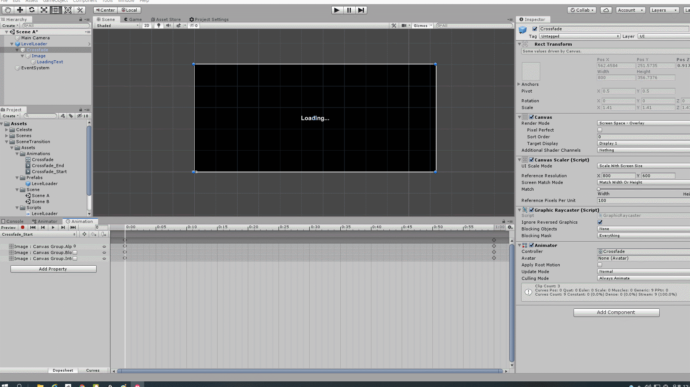

# Explanation Celeste's Movement

## 무엇을 하려고 하는가?

* How-to-guide에서 설명하지 못한 Code Reivew의 해설문서\(Explanation\)을 적고 있습니다.
* Scripting, Animation, Particle System에 관하여 작성합니다.

## Code Explanation



동작의 예외처리문이 많기 때문에 주요 함만 소개하고 해설하는 형식으로 서술하겠습니다. 

```csharp
///<summary>
/// InputManager에서 설정한 정보를 axisName을 통해 가져옵니다.
///</summary>
float x = Input.GetAxis("Horizontal");
float y = Input.GetAxis("Vertical");
```

뒤의 GetAxis의 Parameter를 통해 정보를 가져옵니다. 

해당 정보는 Edit-&gt;Project Setting-&gt;Axes에서 확인할 수 있습니다. 그리고 Walk함수를 통해 Rigidbody2D를 움직여서 이동시킵니다.

```csharp
private void Walk(Vector2 dir) {
    if (!canMove) 
        return;
    
    if (wallGrab) 
        return;
    
    if (!wallJumped) {
        rb.velocity = new Vector2(dir.x * speed, rb.velocity.y);
    } else {
        rb.velocity = Vector2.Lerp(rb.velocity, (new Vector2(dir.x * speed, rb.velocity.y)), wallJumpLerp * Time.deltaTime);
    }
}
```

rb.velocity에 새로운 Vector를 줘서 방향을 부여하고, y축으로는 점프로만 움직이기 때문에 고정 시킵니다. 

여기서는 wallJumped 상태변수를 조건문에 어서 특정 조건을 만족할때는 else구문을 실행시킵니다. 

Vector2.Lerp\(\) 함수는 rb.velocity와 \(new Vector2\(dir.x  _speed, rb.velocity.y\)\) 사이를 연결해서 0부터 1사이의 값을 가진 wallJumpLerp_  Time.deltaTime의 비율에 따라 값을 반환합니다. 

그리고 Animator Component를 받아와서 그 안에 SetHorizontalMovement로 Update안에 선언한 x,y의 값에 따라 parameter를 할당하면 그에 해당하는 Animation을 실행시킵니다.

```csharp
private void Dash(float x, float y){
        Camera.main.transform.DOComplete();                                                             // DOTweening 함수 사용
        Camera.main.transform.DOShakePosition(.2f, .5f, 14, 90, false, true);
        FindObjectOfType<RippleEffect>().Emit(Camera.main.WorldToViewportPoint(transform.position));    // Ripple Effect Script삽입

        hasDashed = true;

        anim.SetTrigger("dash");

        rb.velocity = Vector2.zero;
        Vector2 dir = new Vector2(x, y);

        rb.velocity += dir.normalized * dashSpeed;
        StartCoroutine(DashWait());
    }
```

DoTween API에 관한 자료는 아래의 링크에 들어가서 확인하실 수 있습니다.



간략하게 정리하자면,  DoTween API는 Unity Asset에 import하여 사용할 수 있는 API로써                어떤 기능을 작성하는데 들어가는 Code의 길이를 줄인 Code의 Shortcut을 강점으로 합니다.                 거기서 여러가지 Option을 줘서 작성자가 좀더 유연하게 작성할 수 있도록 도와주는 API라고 설명할 수 있습니다.

DoTween이 알려주는 몇가지 특징이 있습니다.

1. Tween을 만들면 모든 루프가 완료 될 때까지 \(전역 defaultAutoPlay 동작을 변경하지 않는 한\) 자동으로 재생됩니다.
2. Tween이 완료되면 전역 defaultAutoKill 동작을 변경하지 않는 한 자동으로 종료되므로 더 이상 사용할 수 없습니다.
3. 동일한 Tween을 재사용하려면 모든 Tween에 대한 global autoKill 설정을 변경하거나 SetAutoKill \(false\)을 Tween에 연결하여 자동 킬 동작을 FALSE로 설정하십시오.
4. Tween이 재생되는 동안 Tween의 대상이 NULL이되면 오류가 발생할 수 있습니다. 조심하거나 안전 모드를 활성화해야합니다.

API를 사용하는데 있어서 참고 시 이 문서가 유용하게 사용되길 바랍니다.

다시 Code  Review로 돌아가서 Movement.cs의 Dash\(\) 함수에서 사용되는 DoTween은 아래와 같습니다.

Tween method가 실행된 후 RippleEffect Script를 FindObjectOfType으로 찾고 Script 내부의 Emit함수를 실행시킵니다. 그 후 새로운 Vector2를 생성하여 방향을 설정하고 normalized \* dashSpeed를 통해 이동시키고 Coroutine을 시작합니다.

```csharp
IEnumerator DashWait()
    {
        FindObjectOfType<GhostTrail>().ShowGhost();
        StartCoroutine(GroundDash());
        DOVirtual.Float(14, 0, .8f, RigidbodyDrag);

        dashParticle.Play();
        rb.gravityScale = 0;
        GetComponent<BetterJumping>().enabled = false;
        wallJumped = true;
        isDashing = true;

        yield return new WaitForSeconds(.3f);

        dashParticle.Stop();
        rb.gravityScale = 3;
        GetComponent<BetterJumping>().enabled = true;
        wallJumped = false;
        isDashing = false;
    }
```

IEnumerator를 사용하여 함수포인터의 역할 yield문을 만나고 함수의 실행이 종료될 때 까지 반복합니다. 그 후 DOVirtual.Float를 사용합니다.

DOVirtual.Float\(\)를 사용하여 RigidbodyDrag\(\) 함수를 호출하여 14, 0, .8f의 강도로 함수를 실행시킵니다. 다음은 아래의 코드를 실행시키고 yield문을 만나 0.3f Time 후에 아래의 코드를 실행시킵니다.

```csharp
IEnumerator GroundDash()
    {
        yield return new WaitForSeconds(.15f);
        if (coll.onGround)
            hasDashed = false;
    }
```

GroundDash IEnumerator\(열거자\) 입니다. 0.15f Time 후에 아래의 코드를 실행키고 종료합니다.

```csharp
private void WallJump()
    {
        if ((side == 1 && coll.onRightWall) || side == -1 && !coll.onRightWall)
        {
            side *= -1;
            anim.Flip(side);
        }

        StopCoroutine(DisableMovement(0));
        StartCoroutine(DisableMovement(.1f));

        Vector2 wallDir = coll.onRightWall ? Vector2.left : Vector2.right;

        Jump((Vector2.up / 1.5f + wallDir / 1.5f), true);

        wallJumped = true;
    }
```

Update\(\)에서 조건문에 따라 WallJump\(\) 함수를 실행시키는데 조건문에 따라 Sprite Flip을 하고 Coroutine을 실행 시킵니다. 그 후 새로운 Vector2를 생성하는데 coll.onRightWall, 즉 오른쪽인가 아닌가에 따라 Vector2를 할당하고 Jump함수를 실행시킵니다. 

여기서 Jump\(\)함수의 parameter를 보자면 Vector2.up으로 위쪽 Vector를 주고 1.5f + wallDir을 누고 또 1.5f로 나눕니다. 이 부분은 기존의 Jump와는 다르게 벽에서 뛰는 Jump이기 때문에 각도를 조절해줘야 합니다. 이를 위해 Vector2에서 나눈다는 것인데, 

**Vector의 연산에서는 나누기가 없습니다. 내적과 외적은 벡터의 곱이라고 볼 수 있는데 나눗셈은 내적과 외적의 역원이 성립되지 않기 때문에 나눗셈이 정의 될 수 없습니다.** 

그렇기 때문에 위에서 쓰인 나누기연산들은 Vector와 Vector의 나눗셈이 아니라 스칼라와 Vector의 나눗셈이라고 볼 수 있습니다. 그렇기 때문에 방향에 영향을 주지않고 크기에만 영향을 줄 수 있습니다. 이를 통해 WallJump시 크기만 조절할 수 있게 됩니다.

```text
    IEnumerator DisableMovement(float time)
    {
        canMove = false;
        yield return new WaitForSeconds(time);
        canMove = true;
    }
```

위의 IEnumerator\(열거자\)는 Coroutine으로 행동에 딜레이를 거는 함수입니다.

```csharp
    private void Jump(Vector2 dir, bool wall)
    {
        slideParticle.transform.parent.localScale = new Vector3(ParticleSide(), 1, 1);
        ParticleSystem particle = wall ? wallJumpParticle : jumpParticle;

        rb.velocity = new Vector2(rb.velocity.x, 0);
        rb.velocity += dir * jumpForce;

        particle.Play();
    }
```

Jump\(\)함수는 Walk\(\)함수와 마찬가지로 Rigidbody2D의 velocity를 조절하여 방향 Vector인 dir과 jumpForce인 크기를 곱하여 세기를 조절합니다.

```csharp
private void WallSlide()
    {
        if(coll.wallSide != side)
         anim.Flip(side * -1);  

        if (!canMove)
            return;

        bool pushingWall = false;
        if((rb.velocity.x > 0 && coll.onRightWall) || (rb.velocity.x < 0 && coll.onLeftWall))
        {
            pushingWall = true;
        }
        float push = pushingWall ? 0 : rb.velocity.x;

        rb.velocity = new Vector2(push, -slideSpeed);

    }
```

WallSlide\(\)함수에서는 Sprite Flip과 움직일 수 없을 때의 예외\(!canMove\)처리 후 pushingWall이라는 변수를 통해 오른쪽 벽에서 Rigidbody2D.velocity가 움직이거나, 왼쪽 벽에서 Rigidbody2D.velocity가 움직 일때 true로 바꾸고 push변수를 통해 pushingWall에 따라 true면 0, false면 Rigidbody2D.velocity.x를 할당합니다. 그 후 최종적인 Rigidbody2D.velocity의 Vector를 x값이 push, y값이 미끌어져서 떨어지는 수치인 slideSpeed로 할당합니다.


```csharp
    void RigidbodyDrag(float x)
    {
        rb.drag = x;
    }
```


DashWait에서 DOVirtual\(\)함수를 이용하여 Rigidbody Component의 Drag기능을 조절합니다.

```text
    void WallParticle(float vertical)
    {
        var main = slideParticle.main;

        if (wallSlide || (wallGrab && vertical < 0))
        {
            slideParticle.transform.parent.localScale = new Vector3(ParticleSide(), 1, 1);
            main.startColor = Color.white;
        }
        else
        {
            main.startColor = Color.clear;
        }
    }
```

WallParticle 함수는 var변수를 통하여 암시적 변수 타입을 통해 대입되는 값으로 변수형을 결정하여 이를 통해 particle의 Color를 제어합니다. 그리고 조건문에 따라 Particle의 Local Position과 Scale을 정합니다.


```csharp
    int ParticleSide()
    {
        int particleSide = coll.onRightWall ? 1 : -1;
        return particleSide;
    }
```


위의 WallParticle\(\)함수에서 ParticleSide함수를 통해 왼쪽, 오른쪽을 조절합니다.



기존의 Jump기능들은 Rigidbody의 Velocity에 방향과 크기를 곱하여 설정함으로써 기능하지만 부자연스러운 경우가 많습니다. 이때 아래의 Script를 적용시키면 좀 더 자연스럽게 떨어지는 수치를 적합니다.

```csharp
using System.Collections;
using System.Collections.Generic;
using UnityEngine;

public class BetterJumping : MonoBehaviour
{
    /// <summary>
    /// Rigidbody2D, 낙하 곱 수치, 낮게 Jump하면 곱 수치
    /// </summary>
    private Rigidbody2D rb;
    public float fallMultiplier = 2.5f;
    public float lowJumpMultiplier = 2f;

    /// <summary>
    /// 초기화
    /// </summary>
    void Start()
    {
        rb = GetComponent<Rigidbody2D>();
    }

    /// <summary>
    /// Rigidbody.velocity.y의 값에 따라 Jump 동작시 적용
    /// </summary>
    void Update()
    {
        if(rb.velocity.y < 0)
        {
            rb.velocity += Vector2.up * Physics2D.gravity.y * (fallMultiplier - 1) * Time.deltaTime;
        }else if(rb.velocity.y > 0 && !Input.GetButton("Jump"))
        {
            rb.velocity += Vector2.up * Physics2D.gravity.y * (lowJumpMultiplier - 1) * Time.deltaTime;
        }
    }
}

```

Jump기능에 사용할 Rigidbody와 떨어질 때 필요한 변수\(fallMultiplier\), 점프를 할 시 동작할 float 변수\(lowJumpMultiplier\)가 필요합니다.

여기서 필요한 예외처리는 

1. 떨어질 때
2. 점프하고 Jump Button을 손에서 땔 시

Jump\(\) 기능이 동작하면 Rigidbody.velocity.y가 증가하고 떨어진다면 음수값을 띄게 됩니다. 이를 통해 if\(rb.velocity.y &lt; 0\)에서 velocity에 새로운 가산을 더해줍니다. 

Physics2D.gravity는 -9.81값을 가지고 있고 이를 낙하시 중력값을 변경하기 위해 fallMultiplier를 곱합니다.

2번 예외처리를 할 때도 같은 원리로 동작합니다. 하지만 변수값이 다르기 때문에 좀 더 자연스럽게 움직이도록 수를 조정합니다.



Collision.cs에서는 Physics2D.OverlapCircle\(\)함수를 이용하여 충돌검사를 합니다.

```csharp
onWall = Physics2D.OverlapCircle((Vector2)transform.position + rightOffset, collisionRadius, groundLayer) 
            || Physics2D.OverlapCircle((Vector2)transform.position + leftOffset, collisionRadius, groundLayer);
```

아래의 링크에 들어가시면 좀 더 자세한 문서를 살펴볼 수 있습니다.



Checks if a collider falls within a circular area. 

충돌체가 원형 영역 내에 있는지 확인합니다.

 The circle is defined by its centre coordinate in world space and by its radius. The optional _layerMask_ allows the test to check only for objects on specific layers.

원은 월드 공간의 중심 좌표와 반지름으로 정의됩니다. 선택적 layerMask를 사용하면 테스트에서 특정 레이어의 객체 만 확인할 수 있습니다.

 Although the Z axis is not relevant for rendering or collisions in 2D, you can use the _minDepth_ and _maxDepth_ parameters to filter objects based on their Z coordinate. If more than one collider falls within the circle then the one returned will be the one with the lowest Z coordinate value. Null is returned if there are no colliders in the circle. See Also: [OverlapCircleAll](https://docs.unity3d.com/ScriptReference/Physics2D.OverlapCircleAll.html), [OverlapCircleNonAlloc](https://docs.unity3d.com/ScriptReference/Physics2D.OverlapCircleNonAlloc.html).

Z 축은 2D의 렌더링 또는 충돌과 관련이 없지만 minDepth 및 maxDepth 매개 변수를 사용하여 Z 좌표를 기준으로 객체를 필터링 할 수 있습니다. 하나 이상의 충돌체가 원 안에 있으면 Z 좌표 값이 가장 낮은 것이 반환됩니다. 원 안에 충돌체가 없으면 널이 반환됩니다. 참조 : OverlapCircleAll, OverlapCircleNonAlloc.


OverlapCircle\(\)함수와 transform.position + rightOffset, leftOffset, bottomOffset을 더하여 위치를 지정하고 collisionRadius를 통하여 지름을 지정하고 groundLayer를 통하여 LayerMask를 설정합니다. 이렇게 한다면 Inspector에서 설정한 특정 Layer에 접근 할 수 있습니다.



해당 Script에서는 아래와 같은 Component를 사용합니다.

```csharp
    private Animator anim;    // parameter를 Script에서 사용하기 위한 Component
    private Movement move;    // Movement.cs에 있는 bool변수들을 가져오기 위한 Component
    private Collision coll;    // 충돌검사의 결과를 가져오기 위한 Component
    [HideInInspector]
    public SpriteRenderer sr;    // Flip을 위하여 가져오는 Component
```

HideInInspector라는 Attribute를 사용하여 SpriteRenderer를 Inspector에서 숨겨서 이미 있는 Component의 중복을 막습니다.

AnimationScript.cs에서는 Animator에서 설정한 parameter를 Set하는 코드가 주가 되지만 Flip이라는 함수를 통해 Sprite를 Flip합니다.

```csharp
public void Flip(int side)
    {

        if (move.wallGrab || move.wallSlide)
        {
            if (side == -1 && sr.flipX)
                return;

            if (side == 1 && !sr.flipX)
            {
                return;
            }
        }

        bool state = (side == 1) ? false : true;
        sr.flipX = state;
    }
```

side라는 Movement.cs에 존재하는 정수형 변수를 통해 방향을 설정할 수 있습니다. 삼항연산자를 통해 side가 1일 때 false, side가 1이 아닐 때 true를 할당하여 state변수에 할당합니다.

state변수를 가지고 SpriteRenderer에 flipX를 설정합니다.



## Animation





Unity’s Animation features include retargetable animations, full control of animation weights at runtime, event calling from within the animation playback, sophisticated state machine hierarchies and transitions, blend shapes for facial animations, and much more.

Unity의 애니메이션 기능에는 대상 변경 가능 애니메이션, 런타임시 애니메이션 가중치를 완벽하게 제어, 애니메이션 재생 내에서의 이벤트 호출, 정교한 상태 머신 계층 및 전환, 얼굴 애니메이션을위한 블렌드 셰이프 등이 포함됩니다.


Animation에 대한 대략적인 개요입니다. Unity에서의 Animation System은 보통 우리가 Animation이라고 부르는 화면에서 미리 만든 Animation Clip을 활용하여 State Transition의 조건에 따라 Clip을 변경해 나가는 것으로 간추릴 수 있습니다.

Unity에서는 위에서 설명한 기능들을 추가하여 좀 더 쉽게 여러상황에서 편집 기능들을 추가했습니다. 이를 이용하여 Celeste's Movement의 Animation을 작성하는데 아래와 같은 State를 가지고 있습니다.


옆창의 parameter에 따라 State에서 다른 State로 이동하는 화살표\(Transistion\)가 동작합니다. 앞서 AniamtionScript.cs에서 설정한 조건문들은 여기 Animator에 따른 조건들을 설정하고 있으며 기본적으로 주황색 State인 Idle이 Default가 되어 실행됩니다.



정확히는 Animation Clip 제작에 관하여 설명하겠습니다.

Animation을 넣고싶은 Object를 클릭하고 Animation창에서 Create를 누르면 아래와 같은 창이 나타납니다.


중앙에 위치해있는 0:00, 0:01...과 같은 TimeLine에 Sprite를 삽입 하여 하나의 Clip으로 생성합니다.

Celeste's Movement에서는 각 움직임마다 Image가 따로 만들어져 있기에 Sprite를 이어붙여서 동작마다 따로 생성하면 되지만 3D인 경우 혹은, 따로 Animation Clip을 만들기 어려운 경우 Add Property를 이용하여 움직이려고 하는 Animation을 제작할 수 있습니다.


우선 기본 Asset으로 받아놓은 roboMJ\_Spritesheet의 0~7까지의 Sprite를 시간의 변화\(TimeLine\)에 따라 순차적으로 배치하여 Clip을 생성했습니다.


Walk Animation도 마찬가지로 8~15까지의 Sprite를 순차적으로 배치하여 Clip을 생성합니다.

다른 Animation도 마찬가지로 각 동작에 맞는 Clip을 생성하고 Transition에 필요한 parameter를     넣어서 최종적으로는 



Unity Animation에서는 하나의 Conttroller를 가지고 Clip을 조작합니다. 이를 Object에 Component로 넣어서 Transition에 따라 Clip을 변화시킵니다. 그 역활을 하는 Component가 Animator입니다.


Animator를 가지고 원하는 Animation Clip들을 parameter의 변화에 맞춰 조정합니다.


Animation을 만들기 위해 필요한 Clip을 넣고 왼쪽 창에 HorizontalAxis parameter를 생성합니다.   생성한 parameter를 가지고 State에서 다른 State로 이동하기 위한 Transition\(전이\)의 조건으로      넣습니다.


위의 Animator에서는 조건을 2가지를 넣었는데 이는 Make Transition을 2번 하면 화살표가 여러개 생기며 조건이 여러개 있다는 것을 위의 그림과 같이 표시됩니다.



정리하다가 좋은글이 올라왔길래 같이 문서화 시켜봤습니다.



Animator를 가지고 할 수 있는 것들 중 하나가 Scene의 교체입니다.

Animation Clip을 가지고 Canvas Component의 영향을 받는 Component들을 시간이 지남에 따라 조절하여 줄이거나 변화시킵니다. 보통 Asset들을 Loading하는데 시간이 걸릴 때의 과정을 보여줄 필요가 없기에 Loading시 화면을 삽입합니다.

이를 위해 A, B Scene을 생성하여 우선 Scene A에서 아래와 같은 Hierarchy와 Component를 배치합니다.


위의 그림과 같이 배치했다면 몇가지 수정할 점이 있습니다.

* Image의 Anchors를 Anchor Preset에서 최우측 하단의 전체로 설정합니다. 그 후 Transform의 수치\(Left, Right, Top, Bottom, Pos Z\)를 모두 0으로 설정합니다.
* Crossfade Object에서 Canvas Scaler의 UI Scale Mode = Scale With Screen Scale로 설정합니다.
* Text는 표시하고 싶은 임의의 내용을 적습니다.


Scene A -&gt; Scene B로 넘어가는 과정은 Animation을 이용합니다. Animation을 이용해서 Fade in, Fade Out 효과를 제작할 수 있습니다.

우선 2개의 Fade효과를 주기 위한 Clip이 필요합니다. 각 클립은 Image Object의 Canvas Group Component의 Alpha값을 조정하여 Fade 효과를 부여합니다.

2개의 Animation Clip\(Crossfade\_Start, Crossfade\_End\)를 가지고 Alpha값을 조절하는데 다음과 같이 녹화 합니다. 녹화 방법은 참고 영상의 4:41초를 참고하여 제작하시면 됩니다.

제작이 끝났다면 다음과 같은 효과를 가지게 됩니다.




두개의 Clip을 가지고 Animator를 작성합니다 아래와 같은 Animator그림과 같이 state를 배치하고 Transition을 삽입합니다. Start parameter는 Trigger형이며 아래의 Code Block의 Script와 같이 움직입니다.



```csharp
using System.Collections;
using System.Collections.Generic;
using UnityEngine;
using UnityEngine.SceneManagement;
public class LevelLoader: MonoBehaviour {
    public Animator transition;
    [Header("Variable")]
    public float transitionTime = 1 f;
    // Update is called once per frame
    void Update() {
        if (Input.GetMouseButtonDown(0)) {
            LoadNextLevel();
        }
    }
    public void LoadNextLevel() {
        StartCoroutine(LoadLevel(SceneManager.GetActiveScene().buildIndex + 1));
    }
    IEnumerator LoadLevel(int levelIndex) { // Play Animation
        transition.SetTrigger("Start");
        // Wait
        yield return new WaitForSeconds(1);
        // Load Scene
        SceneManager.LoadScene(levelIndex);
    }
}
```


마우스 왼쪽클릭을 하면 코루틴을 사용하여 SetTrigger로 Start를 True로 만들고 1초의 시간이 흐른 뒤 다음 프레임에서 LoadScene을 실행합니다.

위의 Script를 삽입하여 만든 결과는 아래와 같습니다.


\*\*\* Scene Transition시 약간의 Scene B가 보이는 현상을 Crossfade\_Start의 Frame을 60이 아닌 15정도로 축소했습니다.



## 마치며

* Celeste's Movement Project는 여러가지 효과를 사용하여 기본적으로 동작 방법을 확인하는데 유용한 Project인것 같습니다.
* 해설문서\(Explanation\)에서 부족한 함수에 대한 정보는 기술문서\(Technical reference\)에서 설명하도록 하겠습니다.


