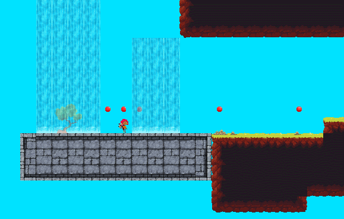
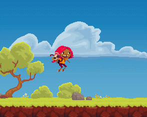
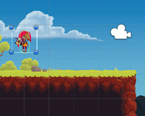
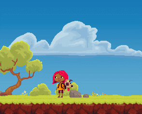

# PhysicsObject

## 왜 해야 하는가?

Unity는 Visual Scripting, 즉 UI를 이용하여 보다 편리하게 Game 작성을 위함인데,

왜? 굳이? Scripting이라는 작업을 통하여 보다 번거롭게 해야 하는가?

보통 RigidBody를 Dynamic으로 많이 쓰지만 Scripting으로 기능을 작성하여 혹여나                                    Dynamic RigidBody에서 쓰지 않을 기능들을 추려낼수 있다는 것으로, 성능 향상에 약간이나마 도움이        될 수도 있다는 생각에 이 글을 작성하게 되었습니다.

그리고 이 예제를 통해 2D Game의 작성 방법과 그에 관련한 움직임 및 물리작용을 공부한다는 목적이       있습니다.

작성된 글은 아래의 링크를 타고 Unity Tutorial을 참고하여 나름대로 정리한 글입니다.                                         아래의 링크를 타고 들어가시면 해당 강의 영상을 시청하실 수 있습니다.

[ **Live Session: 2D Platformer Character Controller - URL**](https://learn.unity.com/tutorial/live-session-2d-platformer-character-controller#)

\*\*\*\*


## **무엇을 하려고 하는가?**



 **Unity를 공부하면서 다른 프로젝트를 통해 움직임을 구현하는 것은 Unity 자체에 내장되어 있는 기능들을 통해 쉽게 구현이 가능하고 재미 또한 있었습니다.**

**하지만 움직임을 Scripting으로 제어한다는 것은 기본적으로 Unity에 있는 기능들을 기존보다 깊게             파고들어야 하기 때문에 어려움이 있었으나, 분명 스킬업이 되었습니다.**

1. 2D platformer game을 위한 맞춤형 스크립트 기반 물리학을 만드는 법을 배웁니다.
2. 수평 이동, 중력 및 취소 가능한 점프를 스크립트를 통해 배웁니다.
3. 충돌을 수동으로 감지하고 경사면과 각진 표면을 처리하는 방법을 배웁니다.


## 작성법

 URL을 타고 들어가 ' Download the asset package [here](http://bit.ly/unity2dController)' 의 here 부분을 누르거나 이 페이지의 here을 눌러서 필요한 Asset들을 다운 받고 파일안에 있는 Asset 파일들을 복사하고, 새로이 Unity Project를 생성하여 생성된 파일경로의 Asset에 복사 붙여넣기는 합니다.                                           

그렇게 된다면 새로이 2DPlatformer라는 파일이 생기고 그 안에 Scene에 들어가서 2DPlatformerMain을    클릭하여 배경화면을 표시합니다. 

다음으로 Prefab Folder로 들어가서 'PlayerStart' Prefab을 드래그 앤 드롭으로 적당한 위치에 배치합니다.



Play를 눌러서 배치한 Scene을 Play한다면 위 그림과 같은 PlayerStart가 멈춰 있는 현상을 볼 수 있는데 Script를 이용하여 중력 적용 및 움직임을 구현해 보겠습니다.

project에 존재하고 있는 Script File에서 'PhysicsObject'라는 새로운 C\# Script를 하나 생성하여 아래와 같은 소스를 복사하여 저장 후 미리 배치한 PlayerStart에 Script Component를 넣습니다.

```text
using System.Collections;
using System.Collections.Generic;
using UnityEngine;

public class PhysicsObject : MonoBehaviour {

    public float minGroundNormalY = .65f;
    public float gravityModifier = 1f;

    protected Vector2 targetVelocity;
    protected bool grounded;
    protected Vector2 groundNormal;
    protected Rigidbody2D rb2d;
    protected Vector2 velocity;
    protected ContactFilter2D contactFilter;
    protected RaycastHit2D[] hitBuffer = new RaycastHit2D[16];
    protected List<RaycastHit2D> hitBufferList = new List<RaycastHit2D> (16);


    protected const float minMoveDistance = 0.001f;
    protected const float shellRadius = 0.01f;

    void OnEnable()
    {
        rb2d = GetComponent<Rigidbody2D> ();
    }

    void Start () 
    {
        contactFilter.useTriggers = false;
        contactFilter.SetLayerMask (Physics2D.GetLayerCollisionMask (gameObject.layer));
        contactFilter.useLayerMask = true;
    }

    void Update () 
    {
        targetVelocity = Vector2.zero;
        ComputeVelocity ();    
    }

    protected virtual void ComputeVelocity()
    {

    }

    void FixedUpdate()
    {
        velocity += gravityModifier * Physics2D.gravity * Time.deltaTime;
        velocity.x = targetVelocity.x;

        grounded = false;

        Vector2 deltaPosition = velocity * Time.deltaTime;

        Vector2 moveAlongGround = new Vector2 (groundNormal.y, -groundNormal.x);

        Vector2 move = moveAlongGround * deltaPosition.x;

        Movement (move, false);

        move = Vector2.up * deltaPosition.y;

        Movement (move, true);
    }

    void Movement(Vector2 move, bool yMovement)
    {
        float distance = move.magnitude;

        if (distance > minMoveDistance) 
        {
            int count = rb2d.Cast (move, contactFilter, hitBuffer, distance + shellRadius);
            hitBufferList.Clear ();
            for (int i = 0; i < count; i++) {
                hitBufferList.Add (hitBuffer [i]);
            }

            for (int i = 0; i < hitBufferList.Count; i++) 
            {
                Vector2 currentNormal = hitBufferList [i].normal;
                if (currentNormal.y > minGroundNormalY) 
                {
                    grounded = true;
                    if (yMovement) 
                    {
                        groundNormal = currentNormal;
                        currentNormal.x = 0;
                    }
                }

                float projection = Vector2.Dot (velocity, currentNormal);
                if (projection < 0) 
                {
                    velocity = velocity - projection * currentNormal;
                }

                float modifiedDistance = hitBufferList [i].distance - shellRadius;
                distance = modifiedDistance < distance ? modifiedDistance : distance;
            }


        }

        rb2d.position = rb2d.position + move.normalized * distance;
    }

}
```

그리고 저장 후에 Scene을 Play 해보면 PlayerStart가 중력의 영향을 받아 아래로 떨어지는 모습을 확인할 수 있습니다. 



그리고 새로운 'PlayerPlatformerController'라는 Script를 하나 생성하여 위와 마찬가지로 PlayerStart Object에 Component로 추가하고 아래와 같은 코드를 복사합니다.

```text
using System.Collections;
using System.Collections.Generic;
using UnityEngine;

public class PlayerPlatformerController : PhysicsObject {

    public float maxSpeed = 7;
    public float jumpTakeOffSpeed = 7;

    private SpriteRenderer spriteRenderer;
    private Animator animator;

    // Use this for initialization
    void Awake () 
    {
        spriteRenderer = GetComponent<SpriteRenderer> ();    
        animator = GetComponent<Animator> ();
    }

    protected override void ComputeVelocity()
    {
        Vector2 move = Vector2.zero;

        move.x = Input.GetAxis ("Horizontal");

        if (Input.GetButtonDown ("Jump") && grounded) {
            velocity.y = jumpTakeOffSpeed;
        } else if (Input.GetButtonUp ("Jump")) 
        {
            if (velocity.y > 0) {
                velocity.y = velocity.y * 0.5f;
            }
        }

        bool flipSprite = (spriteRenderer.flipX ? (move.x > 0.01f) : (move.x < 0.01f));
        if (flipSprite) 
        {
            spriteRenderer.flipX = !spriteRenderer.flipX;
        }

        animator.SetBool ("grounded", grounded);
        animator.SetFloat ("velocityX", Mathf.Abs (velocity.x) / maxSpeed);

        targetVelocity = move * maxSpeed;
    }
}
```

추가를 끝마쳤다면 아래와 같은 그림을 움직이는 PlayerStart Object를 보실 수 있습니다.



자세한 내용은 How-to-guide에서 설명하도록 하겠습니다.




