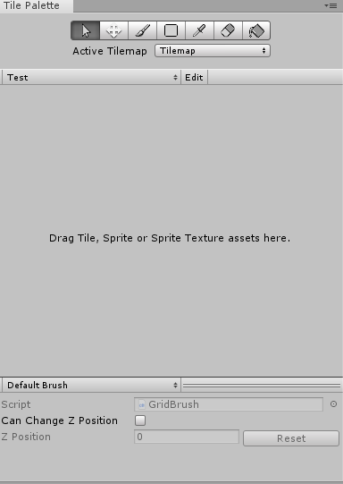

# TileMap

## 왜 해야 하는가?

제가 Unity로 게임을 작성하는데 있어서 큰 문제중 하나는 Map Design였습니다. 보통 Terrain이나 어떤 기초 도안을 가지고 자동적으로 만들어 주는 Terrain Tool도 존재합니다만, 특히 x,y축만 있는 2D게임에 대해 이런 Terrain을 쓰지 않기 때문에 좀더 효율적으로 작성 하기 위해 Unity에는 TileMap기능이 있습니다.

Tilemap의 기본적인 기능을 알아볼때 Scripting보다는 Editor상에서 필요한 작업량이 많기 때문에 Tutorial이 길게 작성할 수 밖에 없음을 사과드립니다.



아래의 링크를 타고 들어가시면 작성하려는 기능의 내용을 볼 수 있습니다.




## 무엇을 하려고 하는가?


Tilemap 기능에 대해 소개를 하고 RuleTile 및 Random Tile과 Procedural patterns이라는 Unity Tutorial을  통해 Map Design을 해보려고 합니다.

* Tilemap을 이용한 간단한 Map Design 및 RuleTile 작성
* 절차적인 패턴\(Procedural patterns\)을 이용한 Map Design 작성

## Tilemap 작성법

Hierarchy창에서 Create, 혹은 우클릭은 눌러서 Tilemap Object를 생성합니다.


Grid Object가 생성되고 자식 Object로 Tilemap Object가 생성되는 것을 확인할 수 있습니다.                                 Grid Object는 말그대로 격자를 표시하기 위한 Grid Component를 포함한 Object이고, Tilemap Object는 Grid Object에 들어갈 Tile을 표시하기 위한 Tilemap Renderer, Tilemap Component 포함되어 있습니다. 

이에 대한 자세한 기능들은 후에 Explanation 항목에 표시하겠습니다.

Tilemap을 넣으려면 Tile Palette라는 기능이 필요하며, 이것은 말 그대로 미술시간때 필요한 팔레트 처럼 Tile Sprite들을 정리하고 섞기 필요한 도구입니다.


Tile Palette 기능을 표시했다면 여기에 필요한 Tile들을 넣어야 합니다. 이를 위해 PhysicsObject에서 사용했던 2D Platformer Game의 Sprite들을 활용하여 넣겠습니다. 



이렇게 새로 생성했다면 드래그 앤 드롭으로 생성할 Tile의 Sprite들을 넣어줍니다. 여기서는 기본적으로 Sprite들이 Tileset Size로 Slice되어 있지만 안되어 있는 Sprite들도 존재합니다. 이에 대한 주의점은 후에 Explanation 문서에 기술 하겠습니다.


위 그림과 같이 Tile들이 격자형태로 나눠진 것을 확인할 수 있으며 이것을 가지고 Tilemap Object에 넣어 주면 TileMap을 배치 할 수 있습니다.


## Rule Tile 작성법

기존에 있던 Tilemap의 보조하는 기능으로써 Unity 내부에 자체적으로 존재하는것이 아니라 외부적으로      기능을 import해야합니다. 여기서는 아래의 Github에서 다운을 받아 Project에 직접 import 합니다.



자료를 다운받아 압축을 풀고 Project에 넣는다면 2d-extras-master라는 File이 Project View에 생성되면서 "Project View"에서 우클릭 후 Create로 가면 가장 위쪽에 Tile이라는 항목이 생성되고 여기서 Rule Tile들을 생성할 수 있습니다.


여기서 Rule Tile에 대해 알아보겠습니다. 

Rule Tile이란? Tile을 만들 때 어떤 규칙이 정해진 타일이라는 것인데, 여기서 규칙이라는 것은 어느 방향을 이야기 합니다. 어느 방향으로는 그리면 안될지 결정한다는 것입니다. 

어차피 Tilemap을 작성해 봤자 하나의 Sprite들을 가지고 여러개를 이어 붙여서 만든것인데, 굳이 필요한 이유를 말씀드리자면 아주 큰 Map Design을 작성할 시에 여러 Sprite를 이어서 만든 어떤 그림이 필요할 때가 종종 있습니다. 그를 대비해 알아둔다면 아주 유용하게 사용할 수 있을 것입니다.


Rule Tile을 생성했다면 위 그림과 같은 Inspector가 생성됩니다.

* Default Sprite에는 기본적으로 Palette에 넣을 화면
* 그 아래 Tiling Rules에는 어떤 규칙으로 하나의 그림을 생성할지에 대한 규칙이 담겨 있습니다.
* 여기서는 Object들로 하지 않고 Tilemap의 Palette를 이용하여 그리기 때문에 Object관련한 내용을             따로 빼서 후에 Explanation 문서에서 작성하도록 하겠습니다.


위 그림과 같이 PhysicsObject tutorial에서 썼던 Sprite들로 Rule을 작성해봤습니다. 어떤 나무를 그린다고 했을 때 위의 4개의 그림을 가지고 작성이 가능합니다. 


위 그림은 9개의 Tile을 추가해서 원하는 모양이 나오도록 각 Tile에 Rule을 추가한 모습입니다. 각 Tile마다 화살표로 방향을 정해줘서 화살표 방향대로 생성되게끔 합니다. X라고 표시된 방향은 생성이 불가합니다.


방향을 제대로 설정했다면 위 그림과 같이 어떤 Size 상관없이 다음과 같은 블록이 생성됩니다.

## Procedural patterns With Tilemap 작성법



We’ll take a look at some of the most common methods of creating a procedural world, and a couple of custom variations that I have created.  Here’s an example of what you may be able to create after reading this article. Three algorithms are working together to create one map, using a [Tilemap](https://docs.unity3d.com/Manual/class-Tilemap.html) and a [RuleTile](https://github.com/Unity-Technologies/2d-extras):

Procedural World를 만들기 위한 일반적인 방법과, 변형적으로 추가한 몇가지 방법들을 소개합니다.다음은 아래의 기사를 읽은 후 만들 수 있는 몇가지 예입니다. 여기서는 Tilemap, Rule Tile을 사용한 세가지의 알고리즘이 하나의 맵을 만듭니다.

When we’re generating a map with any of the algorithms, we will receive an int array which contains all of the new data. We can then take this data and continue to modify it or render it to a tilemap.

알고리즘을 사용하여 맵을 만든다면, 우리는 새로운 데이터가 포함이 된 int형 배열을 받게됩니다.   그런다음 데이터를 가져와서 계속 수정하거나 하나의 Tilemap으로 만들수 있습니다.

Good to know before you read further:

1. The way we distinguish between what’s a tile and what isn’t is by using binary. 1 being on and 0 being off.
2. We will store all of our maps into a 2D integer array, which is returned to the user at the end of each function \(except for when we render\).
3. I will use the array function [GetUpperBound\(\)](https://msdn.microsoft.com/en-us/library/system.array.getupperbound%28v=vs.110%29.aspx) to get the height and width of each map so that we have fewer variables going into each function, and cleaner code.
4. I often use [Mathf.FloorToInt\(\)](https://docs.unity3d.com/ScriptReference/Mathf.FloorToInt.html), this is because the Tilemap coordinate system starts at the bottom left and using Mathf.FloorToInt\(\) allows us to round the numbers to an integer.
5. All of the code provided in this blog post is in C\#.

읽기 전 알아두면 좋은점들 :

1. Tile과 아닌것을 구분하는 방법은 binary를 사용하여 아닌것은 0, tile인 것은 1로 표시합니다.
2. 모든 맵을 2D형 int배열에 저장합니다. 이 배열은 함수의 가장 끝에서 사용자에게 반환됩니다.
3. GetUpperBound\(\)함수를 사용하여 각 맵의 높이와 너비를 가져옵니다. 각 기능에 들어갈                           변수들이 줄어듭니다.
4. 작성자는 종종 Mathf,FloorToInt\(\)함수를 사용합니다. Tilemap 좌표시스템이 왼쪽하단에서 시작되고 해당함수를 사용한다면 int형으로 받기 때문입니다.
5. 모든 코드는 C\#으로 작성됩니다.



GenerateArray creates a new int array of the size given to it. We can also say whether the array should be full or empty \(1 or 0\). Here’s the code:

```text
public static int[] GenerateArray(int width, int height, bool empty) {
    int[] map = new int[width, height];
    for (int x = 0; x < map.GetUpperBound(0); x ++) {
        for (int y = 0; y < map.GetUpperBound(1); y ++) {
            if (empty) {
                map[x, y] = 0;
            } else {
                map[x, y] = 1;
            }
        }
    }
    return map;
}
```







