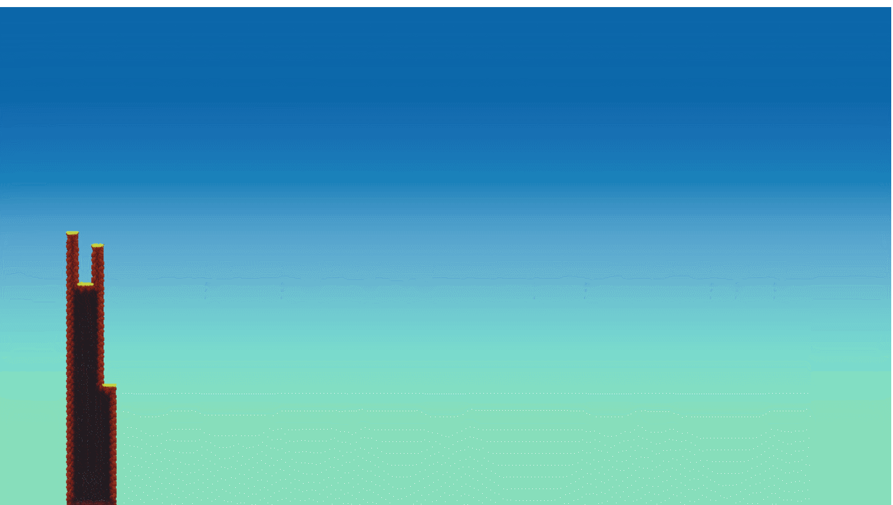
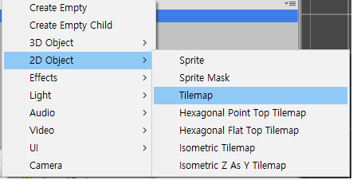
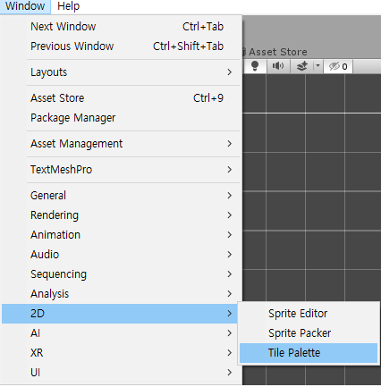
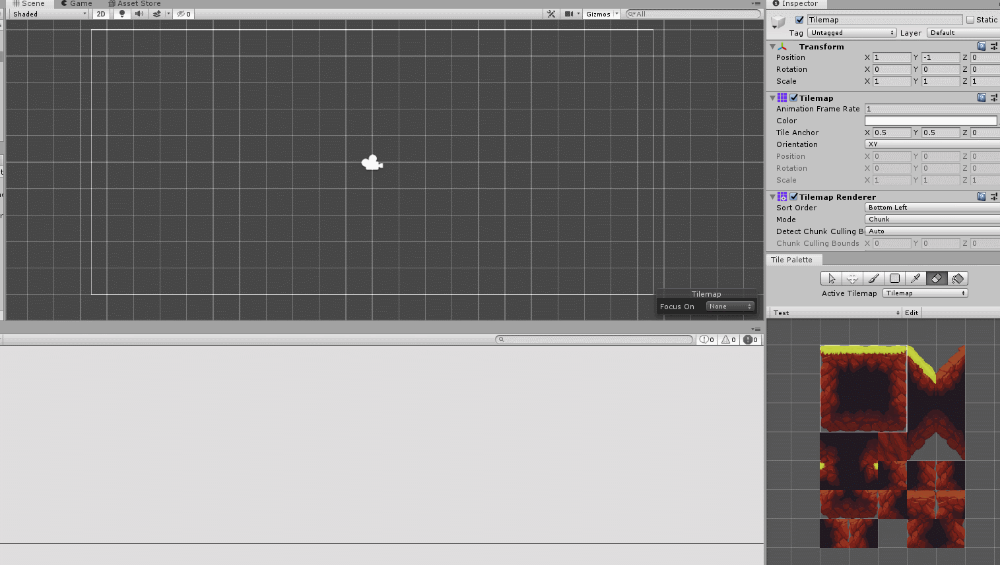
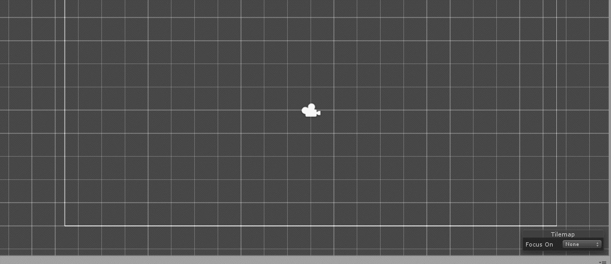

# tutorial TileMap

## 왜 해야 하는가?

제가 Unity로 게임을 작성하는데 있어서 큰 문제중 하나는 Map Design였습니다. 보통 Terrain이나 어떤 기초 도안을 가지고 자동적으로 만들어 주는 Terrain Tool도 존재합니다만, 특히 x,y축만 있는 2D게임에 대해 이런 Terrain을 쓰지 않기 때문에 좀더 효율적으로 작성 하기 위해 Unity에는 TileMap기능이 있습니다.

Tilemap의 기본적인 기능을 알아볼때 Scripting보다는 Editor상에서 필요한 작업량이 많기 때문에 Tutorial이 길게 작성할 수 밖에 없음을 사과드립니다.



아래의 링크를 타고 들어가시면 작성하려는 기능의 내용을 볼 수 있습니다.




## 무엇을 하려고 하는가?



Tilemap 기능에 대해 소개를 하고 RuleTile 및 Random Tile과 Procedural patterns이라는 Unity Tutorial을  통해 Map Design을 해보려고 합니다.

* Tilemap을 이용한 간단한 Map Design 및 RuleTile 작성
* 절차적인 패턴\(Procedural patterns\)을 이용한 Map Design 작성

## Tilemap 작성법

Hierarchy창에서 Create, 혹은 우클릭은 눌러서 Tilemap Object를 생성합니다.



Grid Object가 생성되고 자식 Object로 Tilemap Object가 생성되는 것을 확인할 수 있습니다.                                 Grid Object는 말그대로 격자를 표시하기 위한 Grid Component를 포함한 Object이고, Tilemap Object는 Grid Object에 들어갈 Tile을 표시하기 위한 Tilemap Renderer, Tilemap Component 포함되어 있습니다. 

이에 대한 자세한 기능들은 후에 Explanation 항목에 표시하겠습니다.

Tilemap을 넣으려면 Tile Palette라는 기능이 필요하며, 이것은 말 그대로 미술시간때 필요한 팔레트 처럼 Tile Sprite들을 정리하고 섞기 필요한 도구입니다.



Tile Palette 기능을 표시했다면 여기에 필요한 Tile들을 넣어야 합니다. 이를 위해 PhysicsObject에서 사용했던 2D Platformer Game의 Sprite들을 활용하여 넣겠습니다. 


이렇게 새로 생성했다면 드래그 앤 드롭으로 생성할 Tile의 Sprite들을 넣어줍니다. 여기서는 기본적으로 Sprite들이 Tileset Size로 Slice되어 있지만 안되어 있는 Sprite들도 존재합니다. 이에 대한 주의점은 후에 Explanation 문서에 기술 하겠습니다.


위 그림과 같이 Tile들이 격자형태로 나눠진 것을 확인할 수 있으며 이것을 가지고 Tilemap Object에 넣어 주면 TileMap을 배치 할 수 있습니다.



## Rule Tile 작성법

기존에 있던 Tilemap의 보조하는 기능으로써 Unity 내부에 자체적으로 존재하는것이 아니라 외부적으로      기능을 import해야합니다. 여기서는 아래의 Github에서 다운을 받아 Project에 직접 import 합니다.



자료를 다운받아 압축을 풀고 Project에 넣는다면 2d-extras-master라는 File이 Project View에 생성되면서 "Project View"에서 우클릭 후 Create로 가면 가장 위쪽에 Tile이라는 항목이 생성되고 여기서 Rule Tile들을 생성할 수 있습니다.


여기서 Rule Tile에 대해 알아보겠습니다. 

Rule Tile이란? Tile을 만들 때 어떤 규칙이 정해진 타일이라는 것인데, 여기서 규칙이라는 것은 어느 방향을 이야기 합니다. 어느 방향으로는 그리면 안될지 결정한다는 것입니다. 

어차피 Tilemap을 작성해 봤자 하나의 Sprite들을 가지고 여러개를 이어 붙여서 만든것인데, 굳이 필요한 이유를 말씀드리자면 아주 큰 Map Design을 작성할 시에 여러 Sprite를 이어서 만든 어떤 그림이 필요할 때가 종종 있습니다. 그를 대비해 알아둔다면 아주 유용하게 사용할 수 있을 것입니다.


Rule Tile을 생성했다면 위 그림과 같은 Inspector가 생성됩니다.

* Default Sprite에는 기본적으로 Palette에 넣을 화면
* 그 아래 Tiling Rules에는 어떤 규칙으로 하나의 그림을 생성할지에 대한 규칙이 담겨 있습니다.
* 여기서는 Object들로 하지 않고 Tilemap의 Palette를 이용하여 그리기 때문에 Object관련한 내용을             따로 빼서 후에 Explanation 문서에서 작성하도록 하겠습니다.


위 그림과 같이 PhysicsObject tutorial에서 썼던 Sprite들로 Rule을 작성해봤습니다. 어떤 나무를 그린다고 했을 때 위의 4개의 그림을 가지고 작성이 가능합니다. 


위 그림은 9개의 Tile을 추가해서 원하는 모양이 나오도록 각 Tile에 Rule을 추가한 모습입니다. 각 Tile마다 화살표로 방향을 정해줘서 화살표 방향대로 생성되게끔 합니다. X라고 표시된 방향은 생성이 불가합니다.



방향을 제대로 설정했다면 위 그림과 같이 어떤 Size 상관없이 다음과 같은 블록이 생성됩니다.

## Procedural patterns With Tilemap 작성법

* 아래의 링크에서 해당 Procedural pattern Tilemap example Project 받으실 수 있습니다.




  Rule Tile Project에서 작성한 결과물들을 가지고 새로운 LevelGenerator Object를 생성합니다.


그 후 새로운 C\# Script 3개를 생성하여 다음과 같은 내용들을 넣습니다.



```text
LevelGenerato.cs

using System.Collections;
using System.Collections.Generic;
using UnityEngine;
using UnityEngine.Tilemaps;

#if UNITY_EDITOR
using UnityEditor;
#endif

public class LevelGenerator: MonoBehaviour {
    public Tilemap tilemap;
    public TileBase tile;
    public int width;
    public int height;
    public MapSettings mapSetting;
    void Update() {
        if (Input.GetKeyDown(KeyCode.N)) {
            ClearMap();
            GenerateMap();
        }
    }[ExecuteInEditMode]
    public void GenerateMap() {
        ClearMap();
        int[] map = new int[width, height];
        float seed
        if (mapSetting.randomSeed) {
            seed = Time.time;
        } else {
            seed = mapSetting.seed;
        }
        switch (mapSetting.algorithm) {
            case Algorithm.Perlin:
                map = MapFunctions.GenerateArray(width, height, true);
                map = MapFunctions.PerlinNoise(map, seed);
                break;
            case Algorithm.PerlinSmoothed:
                map = MapFunctions.GenerateArray(width, height, true);
                map = MapFunctions.PerlinNoiseSmooth(map, seed, mapSetting.interval);
                break;
            case Algorithm.PerlinCave:
                map = MapFunctions.GenerateArray(width, height, true);
                map = MapFunctions.PerlinNoiseCave(map, mapSetting.modifier, mapSetting.edgesAreWalls);
                break;
            case Algorithm.RandomWalkTop:
                map = MapFunctions.GenerateArray(width, height, true);
                map = MapFunctions.RandomWalkTop(map, seed);
                break;
            case Algorithm.RandomWalkTopSmoothed:
                map = MapFunctions.GenerateArray(width, height, true);
                map = MapFunctions.RandomWalkTopSmoothed(map, seed, mapSetting.interval);
                break;
            case Algorithm.RandomWalkCave:
                map = MapFunctions.GenerateArray(width, height, false);
                map = MapFunctions.RandomWalkCave(map, seed, mapSetting.clearAmount);
                break;
            case Algorithm.RandomWalkCaveCustom:
                map = MapFunctions.GenerateArray(width, height, false);
                map = MapFunctions.RandomWalkCaveCustom(map, seed, mapSetting.clearAmount);
                break;
            case Algorithm.CellularAutomataVonNeuman:
                map = MapFunctions.GenerateCellularAutomata(width, height, seed, mapSetting.fillAmount, mapSetting.edgesAreWalls);
                map = MapFunctions.SmoothVNCellularAutomata(map, mapSetting.edgesAreWalls, mapSetting.smoothAmount);
                break;
            case Algorithm.CellularAutomataMoore:
                map = MapFunctions.GenerateCellularAutomata(width, height, seed, mapSetting.fillAmount, mapSetting.edgesAreWalls);
                map = MapFunctions.SmoothMooreCellularAutomata(map, mapSetting.edgesAreWalls, mapSetting.smoothAmount);
                break;
            case Algorithm.DirectionalTunnel:
                map = MapFunctions.GenerateArray(width, height, false);
                map = MapFunctions.DirectionalTunnel(map, mapSetting.minPathWidth, mapSetting.maxPathWidth, mapSetting.maxPathChange, mapSetting.roughness, mapSetting.windyness);
                break;
        }
        MapFunctions.RenderMap(map, tilemap, tile);
    }
    public void ClearMap() {
        tilemap.ClearAllTiles();
    }
}[CustomEditor(typeof(LevelGenerator))]
public class LevelGeneratorEditor: Editor {
    public override void OnInspectorGUI() {
        base.OnInspectorGUI();
        LevelGenerator levelGen = (LevelGenerator)target;
        if (levelGen.mapSetting != null) {
            Editor mapSettingEditor = CreateEditor(levelGen.mapSetting);
            mapSettingEditor.OnInspectorGUI();
            if (GUILayout.Button("Generate")) {
                levelGen.GenerateMap();
            }
            if (GUILayout.Button("Clear")) {
                levelGen.ClearMap();
            }
        }
    }
}
```



```text
MapFunctions.cs


using System.Collections;
using System.Collections.Generic;
using UnityEngine;
using UnityEngine.Tilemaps;
public class MapFunctions {
    public static int[] GenerateArray(int width, int height, bool empty) {
        int[] map = new int[width, height];
        for (int x = 0; x < map.GetUpperBound(0); x ++) {
            for (int y = 0; y < map.GetUpperBound(1); y ++) {
                if (empty) {
                    map[x, y] = 0;
                } else {
                    map[x, y] = 1;
                }
            }
        }
        return map;
    }
    public static void RenderMap(int[] map, Tilemap tilemap, TileBase tile) {
        tilemap.ClearAllTiles(); // Clear the map (ensures we dont overlap)
        for (int x = 0; x < map.GetUpperBound(0); x ++) { // Loop through the width of the map
            for (int y = 0; y < map.GetUpperBound(1); y ++) { // Loop through the height of the map
                if (map[x, y] == 1) { // 1 = tile, 0 = no tile
                    tilemap.SetTile(new Vector3Int(x, y, 0), tile);
                }
            }
        }
    }
    public static void RenderMapWithOffset(int[] map, Tilemap tilemap, TileBase tile, Vector2Int offset) {
        for (int x = 0; x < map.GetUpperBound(0); x ++) {
            for (int y = 0; y < map.GetUpperBound(1); y ++) {
                if (map[x, y] == 1) {
                    tilemap.SetTile(new Vector3Int(x + offset.x, y + offset.y, 0), tile);
                }
            }
        }
    }
    public static IEnumerator RenderMapWithDelay(int[] map, Tilemap tilemap, TileBase tile) {
        for (int x = 0; x < map.GetUpperBound(0); x ++) {
            for (int y = 0; y < map.GetUpperBound(1); y ++) {
                if (map[x, y] == 1) {
                    tilemap.SetTile(new Vector3Int(x, y, 0), tile);
                    yield return null;
                }
            }
        }
    }
    public static void UpdateMap(int[] map, Tilemap tilemap) {
        for (int x = 0; x < map.GetUpperBound(0); x ++) {
            for (int y = 0; y < map.GetUpperBound(1); y ++) {
                // We are only going to update the map, rather than rendering again
                // This is because it uses less resources to update tiles to null
                // As opposed to re-drawing every single tile (and collision data)
                if (map[x, y] == 0) {
                    tilemap.SetTile(new Vector3Int(x, y, 0), null);
                }
            }
        }
    }
    public static int[] PerlinNoise(int[] map, float seed) {
        int newPoint;
        // Used to reduced the position of the perlin point
        float reduction = 0.5 f;
        // Create the perlin
        for (int x = 0; x < map.GetUpperBound(0); x ++) {
            newPoint = Mathf.FloorToInt((Mathf.PerlinNoise(x, seed) - reduction) * map.GetUpperBound(1));
            // Make sure the noise starts near the halfway point of the height
            newPoint += (map.GetUpperBound(1) / 2);
            for (int y = newPoint; y >= 0; y --) {
                map[x, y] = 1;
            }
        }
        return map;
    }
    public static int[] PerlinNoiseSmooth(int[] map, float seed, int interval) { // Smooth the noise and store it in the int array
        if (interval > 1) {
            int newPoint,
            points;
            // Used to reduced the position of the perlin point
            float reduction = 0.5 f;
            // Used in the smoothing process
            Vector2Int currentPos,
            lastPos;
            // The corresponding points of the smoothing. One list for x and one for y
            List < int > noiseX = new List<int>();
            List < int > noiseY = new List<int>();
            // Generate the noise
            for (int x = 0; x < map.GetUpperBound(0); x += interval) {
                newPoint = Mathf.FloorToInt((Mathf.PerlinNoise(x, (seed * reduction))) * map.GetUpperBound(1));
                noiseY.Add(newPoint);
                noiseX.Add(x);
            }
            points = noiseY.Count;
            // Start at 1 so we have a previous position already
            for (int i = 1; i < points; i ++) { // Get the current position
                currentPos = new Vector2Int(noiseX[i], noiseY[i]);
                // Also get the last position
                lastPos = new Vector2Int(noiseX[i - 1], noiseY[i - 1]);
                // Find the difference between the two
                Vector2 diff = currentPos - lastPos;
                // Set up what the height change value will be
                float heightChange = diff.y / interval;
                // Determine the current height
                float currHeight = lastPos.y;
                // Work our way through from the last x to the current x
                for (int x = lastPos.x; x < currentPos.x; x ++) {
                    for (int y = Mathf.FloorToInt(currHeight); y > 0; y --) {
                        map[x, y] = 1;
                    }
                    currHeight += heightChange;
                }
            }
        } else { // Defaults to a normal perlin gen
            map = PerlinNoise(map, seed);
        }
        return map;
    }
    public static int[] PerlinNoiseCave(int[] map, float modifier, bool edgesAreWalls) {
        int newPoint;
        for (int x = 0; x < map.GetUpperBound(0); x ++) {
            for (int y = 0; y < map.GetUpperBound(1); y ++) {
                if (edgesAreWalls && (x == 0 || y == 0 || x == map.GetUpperBound(0) - 1 || y == map.GetUpperBound(1) - 1)) { // Keep the edges as walls
                    map[x, y] = 1;
                } else { // Generate a new point using perlin noise, then round it to a value of either 0 or 1
                    newPoint = Mathf.RoundToInt(Mathf.PerlinNoise(x * modifier, y * modifier));
                    map[x, y] = newPoint;
                }
            }
        }
        return map;
    }
    public static int[] RandomWalkTop(int[] map, float seed) { // Seed our random
        System.Random rand = new System.Random(seed.GetHashCode());
        // Set our starting height
        int lastHeight = Random.Range(0, map.GetUpperBound(1));
        // Cycle through our width
        for (int x = 0; x < map.GetUpperBound(0); x ++) { // Flip a coin
            int nextMove = rand.Next(2);
            // If heads, and we aren't near the bottom, minus some height
            if (nextMove == 0 && lastHeight > 2) {
                lastHeight --;
            }
            // If tails, and we aren't near the top, add some height else if (nextMove == 1 && lastHeight < map.GetUpperBound(1) - 2) {
                lastHeight ++;
            }
            // Circle through from the lastheight to the bottom
            for (int y = lastHeight; y >= 0; y --) {
                map[x, y] = 1;
            }
        }
        // Return the map
        return map;
    }
    public static int[] RandomWalkTopSmoothed(int[] map, float seed, int minSectionWidth) { // Seed our random
        System.Random rand = new System.Random(seed.GetHashCode());
        // Determine the start position
        int lastHeight = Random.Range(0, map.GetUpperBound(1));
        // Used to determine which direction to go
        int nextMove = 0;
        // Used to keep track of the current sections width
        int sectionWidth = 0;
        // Work through the array width
        for (int x = 0; x <= map.GetUpperBound(0); x ++) { // Determine the next move
            nextMove = rand.Next(2);
            // Only change the height if we have used the current height more than the minimum required section width
            if (nextMove == 0 && lastHeight > 0 && sectionWidth > minSectionWidth) {
                lastHeight --;
                sectionWidth = 0;
            } else if (nextMove == 1 && lastHeight < map.GetUpperBound(1) && sectionWidth > minSectionWidth) {
                lastHeight ++;
                sectionWidth = 0;
            }
            // Increment the section width
            sectionWidth ++;
            // Work our way from the height down to 0
            for (int y = lastHeight; y >= 0; y --) {
                map[x, y] = 1;
            }
        }
        // Return the modified map
        return map;
    }
    public static int[] RandomWalkCave(int[] map, float seed, int requiredFloorPercent) { // Seed our random
        System.Random rand = new System.Random(seed.GetHashCode());
        // Define our start x position
        int floorX = rand.Next(1, map.GetUpperBound(0) - 1);
        // Define our start y position
        int floorY = rand.Next(1, map.GetUpperBound(1) - 1);
        // Determine our required floorAmount
        int reqFloorAmount = ((map.GetUpperBound(1) * map.GetUpperBound(0)) * requiredFloorPercent) / 100;
        // Used for our while loop, when this reaches our reqFloorAmount we will stop tunneling
        int floorCount = 0;
        // Set our start position to not be a tile (0 = no tile, 1 = tile)
        map[floorX, floorY] = 0;
        // Increase our floor count
        floorCount ++;
        while (floorCount < reqFloorAmount) { // Determine our next direction
            int randDir = rand.Next(4);
            switch (randDir) {
                case 0:
                    // Up
                    // Ensure that the edges are still tiles
                    if ((floorY + 1) < map.GetUpperBound(1) - 1) { // Move the y up one
                        floorY ++;
                        // Check if that piece is currently still a tile
                        if (map[floorX, floorY] == 1) { // Change it to not a tile
                            map[floorX, floorY] = 0;
                            // Increase floor count
                            floorCount ++;
                        }
                    }
                    break;
                case 1:
                    // Down
                    // Ensure that the edges are still tiles
                    if ((floorY - 1) > 1) { // Move the y down one
                        floorY --;
                        // Check if that piece is currently still a tile
                        if (map[floorX, floorY] == 1) { // Change it to not a tile
                            map[floorX, floorY] = 0;
                            // Increase the floor count
                            floorCount ++;
                        }
                    }
                    break;
                case 2:
                    // Right
                    // Ensure that the edges are still tiles
                    if ((floorX + 1) < map.GetUpperBound(0) - 1) { // Move the x to the right
                        floorX ++;
                        // Check if that piece is currently still a tile
                        if (map[floorX, floorY] == 1) { // Change it to not a tile
                            map[floorX, floorY] = 0;
                            // Increase the floor count
                            floorCount ++;
                        }
                    }
                    break;
                case 3:
                    // Left
                    // Ensure that the edges are still tiles
                    if ((floorX - 1) > 1) { // Move the x to the left
                        floorX --;
                        // Check if that piece is currently still a tile
                        if (map[floorX, floorY] == 1) { // Change it to not a tile
                            map[floorX, floorY] = 0;
                            // Increase the floor count
                            floorCount ++;
                        }
                    }
                    break;
            }
        }
        // Return the updated map
        return map;
    }
    public static int[] RandomWalkCaveCustom(int[] map, float seed, int requiredFloorPercent) { // Seed our random
        System.Random rand = new System.Random(seed.GetHashCode());
        // Define our start x position
        int floorX = Random.Range(1, map.GetUpperBound(0) - 1);
        // Define our start y position
        int floorY = Random.Range(1, map.GetUpperBound(1) - 1);
        // Determine our required floorAmount
        int reqFloorAmount = ((map.GetUpperBound(1) * map.GetUpperBound(0)) * requiredFloorPercent) / 100;
        // Used for our while loop, when this reaches our reqFloorAmount we will stop tunneling
        int floorCount = 0;
        // Set our start position to not be a tile (0 = no tile, 1 = tile)
        map[floorX, floorY] = 0;
        // Increase our floor count
        floorCount ++;
        while (floorCount < reqFloorAmount) { // Determine our next direction
            int randDir = rand.Next(8);
            switch (randDir) {
                case 0:
                    // North-West
                    // Ensure we don't go off the map
                    if ((floorY + 1) < map.GetUpperBound(1) && (floorX - 1) > 0) { // Move the y up
                        floorY ++;
                        // Move the x left
                        floorX --;
                        // Check if the position is a tile
                        if (map[floorX, floorY] == 1) { // Change it to not a tile
                            map[floorX, floorY] = 0;
                            // Increase floor count
                            floorCount ++;
                        }
                    }
                    break;
                case 1:
                    // North
                    // Ensure we don't go off the map
                    if ((floorY + 1) < map.GetUpperBound(1)) { // Move the y up
                        floorY ++;
                        // Check if the position is a tile
                        if (map[floorX, floorY] == 1) { // Change it to not a tile
                            map[floorX, floorY] = 0;
                            // Increase the floor count
                            floorCount ++;
                        }
                    }
                    break;
                case 2:
                    // North-East
                    // Ensure we don't go off the map
                    if ((floorY + 1) < map.GetUpperBound(1) && (floorX + 1) < map.GetUpperBound(0)) { // Move the y up
                        floorY ++;
                        // Move the x right
                        floorX ++;
                        // Check if the position is a tile
                        if (map[floorX, floorY] == 1) { // Change it to not a tile
                            map[floorX, floorY] = 0;
                            // Increase the floor count
                            floorCount ++;
                        }
                    }
                    break;
                case 3:
                    // East
                    // Ensure we don't go off the map
                    if ((floorX + 1) < map.GetUpperBound(0)) { // Move the x right
                        floorX ++;
                        // Check if the position is a tile
                        if (map[floorX, floorY] == 1) { // Change it to not a tile
                            map[floorX, floorY] = 0;
                            // Increase the floor count
                            floorCount ++;
                        }
                    }
                    break;
                case 4:
                    // South-East
                    // Ensure we don't go off the map
                    if ((floorY - 1) > 0 && (floorX + 1) < map.GetUpperBound(0)) { // Move the y down
                        floorY --;
                        // Move the x right
                        floorX ++;
                        // Check if the position is a tile
                        if (map[floorX, floorY] == 1) { // Change it to not a tile
                            map[floorX, floorY] = 0;
                            // Increase the floor count
                            floorCount ++;
                        }
                    }
                    break;
                case 5:
                    // South
                    // Ensure we don't go off the map
                    if ((floorY - 1) > 0) { // Move the y down
                        floorY --;
                        // Check if the position is a tile
                        if (map[floorX, floorY] == 1) { // Change it to not a tile
                            map[floorX, floorY] = 0;
                            // Increase the floor count
                            floorCount ++;
                        }
                    }
                    break;
                case 6:
                    // South-West
                    // Ensure we don't go off the map
                    if ((floorY - 1) > 0 && (floorX - 1) > 0) { // Move the y down
                        floorY --;
                        // move the x left
                        floorX --;
                        // Check if the position is a tile
                        if (map[floorX, floorY] == 1) { // Change it to not a tile
                            map[floorX, floorY] = 0;
                            // Increase the floor count
                            floorCount ++;
                        }
                    }
                    break;
                case 7:
                    // West
                    // Ensure we don't go off the map
                    if ((floorX - 1) > 0) { // Move the x left
                        floorX --;
                        // Check if the position is a tile
                        if (map[floorX, floorY] == 1) { // Change it to not a tile
                            map[floorX, floorY] = 0;
                            // Increase the floor count
                            floorCount ++;
                        }
                    }
                    break;
            }
        }
        return map;
    }
    public static int[] DirectionalTunnel(int[] map, int minPathWidth, int maxPathWidth, int maxPathChange, int roughness, int windyness) { // This value goes from its minus counterpart to its positive value, in this case with a width value of 1, the width of the tunnel is 3
        int tunnelWidth = 1;
        // Set the start X position to the center of the tunnel
        int x = map.GetUpperBound(0) / 2;
        // Set up our seed for the random.
        System.Random rand = new System.Random(Time.time.GetHashCode());
        // Create the first part of the tunnel
        for (int i = -tunnelWidth; i <= tunnelWidth; i ++) {
            map[
                x + i,
                0
            ] = 0;
        }
        // Cycle through the array
        for (int y = 1; y < map.GetUpperBound(1); y ++) { // Check if we can change the roughness
            if (rand.Next(0, 100) > roughness) { // Get the amount we will change for the width
                int widthChange = Random.Range(-maxPathWidth, maxPathWidth);
                tunnelWidth += widthChange;
                // Check to see we arent making the path too small
                if (tunnelWidth < minPathWidth) {
                    tunnelWidth = minPathWidth;
                }
                // Check that the path width isnt over our maximum
                if (tunnelWidth > maxPathWidth) {
                    tunnelWidth = maxPathWidth;
                }
            }
            // Check if we can change the windyness
            if (rand.Next(0, 100) > windyness) { // Get the amount we will change for the x position
                int xChange = Random.Range(-maxPathChange, maxPathChange);
                x += xChange;
                // Check we arent too close to the left side of the map
                if (x < maxPathWidth) {
                    x = maxPathWidth;
                }
                // Check we arent too close to the right side of the map
                if (x > (map.GetUpperBound(0) - maxPathWidth)) {
                    x = map.GetUpperBound(0) - maxPathWidth;
                }
            }
            // Work through the width of the tunnel
            for (int i = -tunnelWidth; i <= tunnelWidth; i ++) {
                map[
                    x + i,
                    y
                ] = 0;
            }
        }
        return map;
    }
    public static int[] GenerateCellularAutomata(int width, int height, float seed, int fillPercent, bool edgesAreWalls) { // Seed our random number generator
        System.Random rand = new System.Random(seed.GetHashCode());
        // Set up the size of our array
        int[] map = new int[width, height];
        // Start looping through setting the cells.
        for (int x = 0; x < map.GetUpperBound(0); x ++) {
            for (int y = 0; y < map.GetUpperBound(1); y ++) {
                if (edgesAreWalls && (x == 0 || x == map.GetUpperBound(0) - 1 || y == 0 || y == map.GetUpperBound(1) - 1)) { // Set the cell to be active if edges are walls
                    map[x, y] = 1;
                } else { // Set the cell to be active if the result of rand.Next() is less than the fill percentage
                    map[x, y] = (rand.Next(0, 100) < fillPercent)
                        ? 1
                        : 0;
                }
            }
        }
        return map;
    }
    public static int[] SmoothVNCellularAutomata(int[] map, bool edgesAreWalls, int smoothCount) {
        for (int i = 0; i < smoothCount; i ++) {
            for (int x = 0; x < map.GetUpperBound(0); x ++) {
                for (int y = 0; y < map.GetUpperBound(1); y ++) { // Get the surrounding tiles
                    int surroundingTiles = GetVNSurroundingTiles(map, x, y, edgesAreWalls);
                    if (edgesAreWalls && (x == 0 || x == map.GetUpperBound(0) - 1 || y == 0 || y == map.GetUpperBound(1))) {
                        map[x, y] = 1; // Keep our edges as walls
                    }
                    // von Neuemann Neighbourhood requires only 3 or more surrounding tiles to be changed to a tile else if (surroundingTiles > 2) {
                        map[x, y] = 1;
                    }
                    // If we have less than 2 neighbours, set the tile to be inactive else if (surroundingTiles < 2) {
                        map[x, y] = 0;
                    }
                    // Do nothing if we have 2 neighbours
                }
            }
        }
        return map;
    }
    static int GetVNSurroundingTiles(int[] map, int x, int y, bool edgesAreWalls) { /* von Neumann Neighbourhood looks like this ('T' is our Tile, 'N' is our Neighbour)
		* 
		*   N 
		* N T N
		*   N
		*   
		*/
        int tileCount = 0;
        // If we are not touching the left side of the map
        if (x - 1 > 0) {
            tileCount += map[
                x - 1,
                y
            ];
        } else if (edgesAreWalls) {
            tileCount ++;
        }
        // If we are not touching the bottom of the map
        if (y - 1 > 0) {
            tileCount += map[
                x,
                y - 1
            ];
        } else if (edgesAreWalls) {
            tileCount ++;
        }
        // If we are not touching the right side of the map
        if (x + 1 < map.GetUpperBound(0)) {
            tileCount += map[
                x + 1,
                y
            ];
        } else if (edgesAreWalls) {
            tileCount ++;
        }
        // If we are not touching the top of the map
        if (y + 1 < map.GetUpperBound(1)) {
            tileCount += map[
                x,
                y + 1
            ];
        } else if (edgesAreWalls) {
            tileCount ++;
        }
        return tileCount;
    }
    public static int[] SmoothMooreCellularAutomata(int[] map, bool edgesAreWalls, int smoothCount) {
        for (int i = 0; i < smoothCount; i ++) {
            for (int x = 0; x < map.GetUpperBound(0); x ++) {
                for (int y = 0; y < map.GetUpperBound(1); y ++) {
                    int surroundingTiles = GetMooreSurroundingTiles(map, x, y, edgesAreWalls);
                    // Set the edge to be a wall if we have edgesAreWalls to be true
                    if (edgesAreWalls && (x == 0 || x == (map.GetUpperBound(0) - 1) || y == 0 || y == (map.GetUpperBound(1) - 1))) {
                        map[x, y] = 1;
                    }
                    // If we have more than 4 neighbours, change to an active cell else if (surroundingTiles > 4) {
                        map[x, y] = 1;
                    }
                    // If we have less than 4 neighbours, change to be an inactive cell else if (surroundingTiles < 4) {
                        map[x, y] = 0;
                    }
                    // If we have exactly 4 neighbours, do nothing
                }
            }
        }
        return map;
    }
    static int GetMooreSurroundingTiles(int[] map, int x, int y, bool edgesAreWalls) { /* Moore Neighbourhood looks like this ('T' is our tile, 'N' is our neighbours)
         * 
         * N N N
         * N T N
         * N N N
         * 
         */
        int tileCount = 0;
        // Cycle through the x values
        for (int neighbourX = x - 1; neighbourX <= x + 1; neighbourX ++) { // Cycle through the y values
            for (int neighbourY = y - 1; neighbourY <= y + 1; neighbourY ++) {
                if (neighbourX >= 0 && neighbourX < map.GetUpperBound(0) && neighbourY >= 0 && neighbourY < map.GetUpperBound(1)) { // We don't want to count the tile we are checking the surroundings of
                    if (neighbourX != x || neighbourY != y) {
                        tileCount += map[neighbourX, neighbourY];
                    }
                }
            }
        }
        return tileCount;
    }
}
```



```text
using System.Collections;
using System.Collections.Generic;
using UnityEngine;
using UnityEngine.UI;
#if UNITY_EDITOR
using UnityEditor;
#endif
public enum Algorithm {
    Perlin,
    PerlinSmoothed,
    PerlinCave,
    RandomWalkTop,
    RandomWalkTopSmoothed,
    RandomWalkCave,
    RandomWalkCaveCustom,
    CellularAutomataVonNeuman,
    CellularAutomataMoore,
    DirectionalTunnel
}[System.Serializable]
[CreateAssetMenu(fileName = "NewMapSettings", menuName = "Map Settings", order = 0)]
public class MapSettings: ScriptableObject {
    public Algorithm algorithm;
    public bool randomSeed;
    public float seed;
    public int fillAmount;
    public int smoothAmount;
    public int clearAmount;
    public int interval;
    public int minPathWidth,
    maxPathWidth,
    maxPathChange,
    roughness,
    windyness;
    public bool edgesAreWalls;
    public float modifier;
}[CustomEditor(typeof(MapSettings))]
public class MapSettings_Editor: Editor {
    public override void OnInspectorGUI() {
        MapSettings mapLayer = (MapSettings)target;
        GUI.changed = false;
        EditorGUILayout.LabelField(mapLayer.name, EditorStyles.boldLabel);
        mapLayer.algorithm = (Algorithm)EditorGUILayout.EnumPopup(new GUIContent("Generation Method", "The generation method we want to use to generate the map"), mapLayer.algorithm);
        mapLayer.randomSeed = EditorGUILayout.Toggle("Random Seed ", mapLayer.randomSeed);
        if (!mapLayer.randomSeed) {
            mapLayer.seed = EditorGUILayout.FloatField("Seed", mapLayer.seed);
        }
        switch (mapLayer.algorithm) {
            case Algorithm.Perlin:
                // No additional Variables
                break;
            case Algorithm.PerlinSmoothed:
                mapLayer.interval = EditorGUILayout.IntSlider("Interval Of Points", mapLayer.interval, 1, 10);
                break;
            case Algorithm.PerlinCave:
                mapLayer.edgesAreWalls = EditorGUILayout.Toggle("Edges Are Walls", mapLayer.edgesAreWalls);
                mapLayer.modifier = EditorGUILayout.Slider("Modifier", mapLayer.modifier, 0.0001 f, 1.0 f);
                break;
            case Algorithm.RandomWalkTop:
                // No additional Variables
                break;
            case Algorithm.RandomWalkTopSmoothed:
                mapLayer.interval = EditorGUILayout.IntSlider("Minimum Section Length", mapLayer.interval, 1, 10);
                break;
            case Algorithm.RandomWalkCave:
                mapLayer.clearAmount = EditorGUILayout.IntSlider("Amount To Clear", mapLayer.clearAmount, 0, 100);
                break;
            case Algorithm.RandomWalkCaveCustom:
                mapLayer.clearAmount = EditorGUILayout.IntSlider("Amount To Clear", mapLayer.clearAmount, 0, 100);
                break;
            case Algorithm.CellularAutomataVonNeuman:
                mapLayer.edgesAreWalls = EditorGUILayout.Toggle("Edges Are Walls", mapLayer.edgesAreWalls);
                mapLayer.fillAmount = EditorGUILayout.IntSlider("Fill Percentage", mapLayer.fillAmount, 0, 100);
                mapLayer.smoothAmount = EditorGUILayout.IntSlider("Smooth Amount", mapLayer.smoothAmount, 0, 10);
                break;
            case Algorithm.CellularAutomataMoore:
                mapLayer.edgesAreWalls = EditorGUILayout.Toggle("Edges Are Walls", mapLayer.edgesAreWalls);
                mapLayer.fillAmount = EditorGUILayout.IntSlider("Fill Percentage", mapLayer.fillAmount, 0, 100);
                mapLayer.smoothAmount = EditorGUILayout.IntSlider("Smooth Amount", mapLayer.smoothAmount, 0, 10);
                break;
            case Algorithm.DirectionalTunnel:
                mapLayer.minPathWidth = EditorGUILayout.IntField("Minimum Path Width", mapLayer.minPathWidth);
                mapLayer.maxPathWidth = EditorGUILayout.IntField("Maximum Path Width", mapLayer.maxPathWidth);
                mapLayer.maxPathChange = EditorGUILayout.IntField("Maximum Path Change", mapLayer.maxPathChange);
                mapLayer.windyness = EditorGUILayout.IntSlider(new GUIContent("Windyness", "This is checked against a random number to determine if we can change the paths current x position"), mapLayer.windyness, 0, 100);
                mapLayer.roughness = EditorGUILayout.IntSlider(new GUIContent("Roughness", "This is checked against a random number to determine if we can change the width of the tunnel"), mapLayer.roughness, 0, 100);
                break;
        }
        EditorGUILayout.LabelField("", GUI.skin.horizontalSlider);
        AssetDatabase.SaveAssets();
        if (GUI.changed) 
            EditorUtility.SetDirty(mapLayer);
        
    }
}
```



그 후 LevelGenerator Object에 LevelGenerator.cs Script를 추가합니다. LevelGenerator에 필요한 Tilemap Object은 Heierarchy의 Grid의 자식Object인 Tilemap이며, Rule Tile은 위에서 만든 RuleTile을 사용합니다. 그러면 아래와 같은 그림의 Inspector가 존재하게 됩니다.


 다음은 LevelGenerator.cs의 MapSetting Component에 들어갈 MapSetting.asset을 생성해야 하는데 이미 Script에서 Editor수정을 통해 Project View에서 생성 가능하도록 코딩했기 때문에 Project View에서 우클릭으로 생성합니다.


이제 MapSetting이 끝났고, LevelGenerator에서 MapSetting을 추가하여 Generation Method를 통해 만들고 싶은 Pattern의 Method를 선택해서 사용합니다.


## 마치며

* Procedural Pattern Tilemap에 대해서는 How-to-guide가 짧을 수 있습니다. 
* 해설문서\(Explanation\)에서 구체적인 Generate Method에 대해서 부연설명을 하겠습니다.






