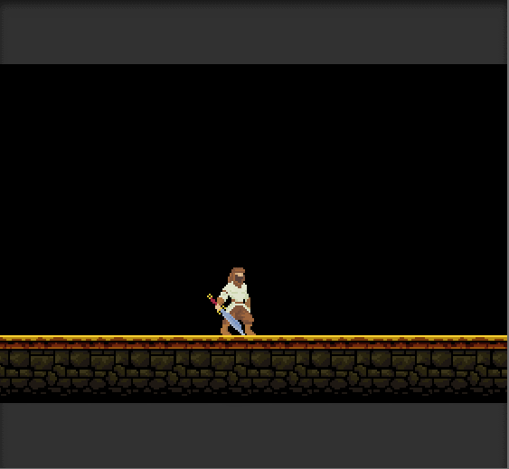
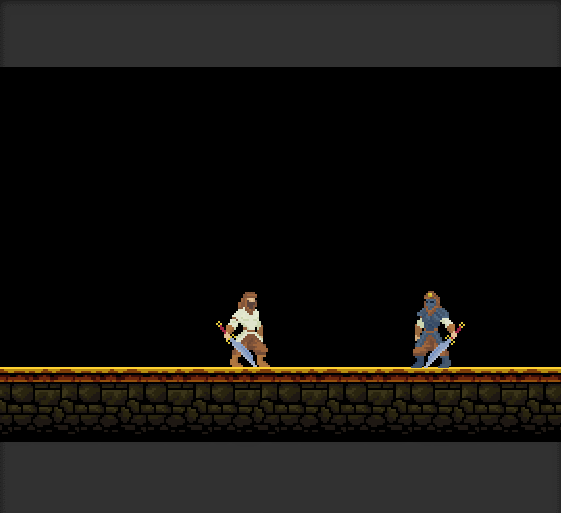

# tutorial Melee Attack

## 무엇을 하려고 하는가?

* 움직임, Animation에 관한 문서는 많지만 실질적으로 Game이 성립하기 위한 요소 중 하나인, Action에 관한 문서가 없었기에 해당 문서를 작성합니다.
* 이 문서에서는 2D Melee Attack에 관한 기본적인 내용을 다루고 있습니다.
* 이 문서를 가지고 상업적으로 이용하지 않습니다.



## 작성법

* 아래의 링크를 들어가 Asset을 다운 받던지 Asset Store에서 "Bandits"라고 검색하면 해당 Pixel Art가 나옵니다.



* Tilemap을 사용하여 Map Design을 간단히 합니다. 하지만 아래의 그림과 같이 각 Grid간 간격에 대해 공백을 가지고 있습니다.


* 위의 그림을 활용할 이를 위해 조정해야 할것이 있습니다.
  * **Tilemap을 생성해 Camera : 0.9 / Grid Sell Size : x\(0.32\), y\(0.2\)정도로 조정합니다.**
  * **Camera와 Sell Size를 축소 시키고 싶지 않다면, 해당 Tilemap을 구성하는 Sprite의 Pixels Per Unit의 크기를 조정하여 확대 시킵니다.**
    * **Pixels Per Unit이란?**
      * Unit 당 얼마정도의 Pixel을 할당할 것인가에 대한 Component입니다.
      * Unity는 Unit이라는 고유 단위를 사용하며, 1 Unit = 1M\(meter\)로 사용합니다.
      * 즉, 1M당 얼마정도의 Pixel을 할당하여 Sprite를 표시할 것인가에 대한 이야기 입니다. 자세한 내용에 대한 참조는 아래의 링크로 들어가셔서 볼 수 있습니다.
    * 크기를 조정할 대상은 다운받은 Asset의 EnvironmentTiles이나, HeavyBandit, LightBandit에 적용시킵니다.
    * Camera Size가 기본적으로 5에 맞춰져 있기 때문에 Asset의 Pixels Per Unit을 32 정도 맞추는게 적당했습니다. 
    * **이러한 방법은 Pixel이 깨질 수도 있으니, 사용할 때 주의해야할 부분입니다.**
  * Camera BackGround Color = Black으로 설정합니다.



* 위의 해결 방안을 채택 했다면 아래의 그림과 같이 적절하게 표시됩니다.


* Tilemap에 Tilemap Collider2D\(Used By Composite = true\), Rigidbody2D\(static\), Composite Collider2D를 추가하고 제대로 충돌되는지 확인합니다.


LightBandit을 움직이게 하기 위해 아래와 같이 Component를 수정합니다.

* Tranform : 적당한 곳에 위치 시킵니다.
* Animator : 기존 Animator를 그대로 씁니다.
* Sprite Renderer : 변경 사항이 없습니다.
* Rigidbody2D : Constraints\(z\)값을 true로 설정합니다.
* Box Collider2D : 변경사항이 없습니다.
* Bandit\(Script\) : 기존의 Script를 아래의 코드로 붙여넣습니다.


```csharp
using UnityEngine;
using System.Collections;

public class Bandit : MonoBehaviour {

    [SerializeField] float      m_speed = 1.0f;
    [SerializeField] float      m_jumpForce = 2.0f;

    private Animator            m_animator;
    private Rigidbody2D         m_body2d;
    private Sensor_Bandit       m_groundSensor;
    private bool                m_grounded = false;
    private bool                m_combatIdle = false;
    private bool                m_isDead = false;

    [Header("Attack Property")]
    public Transform attackPoint;
    public int attackDamage = 0;
    public float attackRadius = 0.5f;
    public LayerMask enemyLayer;
    public float playerHP = 100f;
    public float attackRate = 2f;
    float nextAttackTime = 0f;

    // Use this for initialization
    void Start () {
        m_animator = GetComponent<Animator>();
        m_body2d = GetComponent<Rigidbody2D>();
        m_groundSensor = transform.Find("GroundSensor").GetComponent<Sensor_Bandit>();
    }
	
	// Update is called once per frame
	void Update () {
        Movement();
    }

    void Movement()
    {
        // -- Handle input and movement --
        float inputX = Input.GetAxis("Horizontal");

        // Swap direction of sprite depending on walk direction
        if (inputX > 0)
            GetComponent<SpriteRenderer>().flipX = true;
        else if (inputX < 0)
            GetComponent<SpriteRenderer>().flipX = false;

        // Move
        m_body2d.velocity = new Vector2(inputX * m_speed, m_body2d.velocity.y);

        //Set AirSpeed in animator
        m_animator.SetFloat("AirSpeed", m_body2d.velocity.y);

        HandleAnimation(inputX);
    }

    void HandleAnimation(float inputX)
    {
        //Check if character just landed on the ground
        if (!m_grounded && m_groundSensor.State())
        {
            m_grounded = true;
            m_animator.SetBool("Grounded", m_grounded);
        }

        //Check if character just started falling
        if (m_grounded && !m_groundSensor.State())
        {
            m_grounded = false;
            m_animator.SetBool("Grounded", m_grounded);
        }

        // -- Handle Animations --
        //Death
        if (Input.GetKeyDown("e"))
        {
            if (!m_isDead)
                m_animator.SetTrigger("Death");
            else
                m_animator.SetTrigger("Recover");

            m_isDead = !m_isDead;
        }

        //Hurt
        else if (Input.GetKeyDown("q"))
            m_animator.SetTrigger("Hurt");

        //Attack
        if (Time.time >= nextAttackTime)
        {
            if (Input.GetMouseButtonDown(0))
            {
                Attack();
                nextAttackTime = Time.time + 1f / attackRate;
            }
        }

        //Change between idle and combat idle
        else if (Input.GetKeyDown("f"))
            m_combatIdle = !m_combatIdle;

        //Jump
        else if (Input.GetKeyDown("space") && m_grounded)
        {
            m_animator.SetTrigger("Jump");
            m_grounded = false;
            m_animator.SetBool("Grounded", m_grounded);
            m_body2d.velocity = new Vector2(m_body2d.velocity.x, m_jumpForce);
            m_groundSensor.Disable(0.2f);
        }

        //Run
        if (Mathf.Abs(inputX) > Mathf.Epsilon)
            m_animator.SetInteger("AnimState", 2);

        //Combat Idle
        else if (m_combatIdle)
            m_animator.SetInteger("AnimState", 1);

        //Idle
        else
            m_animator.SetInteger("AnimState", 0);
    }

    void Attack()
    {
        m_animator.SetTrigger("Attack");
        Collider2D[] hitEnemies = Physics2D.OverlapCircleAll(attackPoint.position, attackRadius, enemyLayer);

        foreach(Collider2D enemy in hitEnemies)
        {
            Debug.Log("Hit :" + enemy.name);
            enemy.GetComponent<EnemyScript>().TakeDamage(attackDamage);
        }
    }

    void OnDrawGizmoSelected()
    {
        if (attackPoint == null) return;

        Gizmos.DrawWireSphere(attackPoint.position, attackRadius);
    }
}

```


* 기존의 Animator를 쓰기 때문에 LightBandit Object는 더이상 수정하지 않습니다.
* 그 결과로 아래와 같 Animation과 움직임을 가지게 됩니다.



* Enemy를 생성하기 위해 다운받은 Asset의 HeavyBandit을 화면상에 배치합니다.
* HeavyBandit은 다른 움직임 없이 오직 Player가 Melee Attack을 할 수 있는지에 대한 Test Object이기 때문에 Component에 대한 수정이 필요합니다.


아래의 항목들로 각 Component를 수정합니다.

* Tranform : 적당한 곳에 위치 시킵니다.
* Animator : 새로운 Animator를 생성하여 할당합니다.
  * 기존의 Animator는 Animator Override Controller 항목을 통해 LightBandit\_AnimController를 상속 받은 것입니다.
  * 아래의 그림과 같은 Animation State를 할당합니다.
  * 각 Animation Clip을 기존의 HeavyBandit의 Hurt, Dead Clip을 이용합니다.


* Sprite Renderer : 변경 사항이 없습니다.
* Rigidbody2D : Constraints\(x, y, z\)값을 모두 true로 설정합니다.
  * 나중에 HeavyBandit이 Die 상태일 때 Collider를 비활성화 시켜야 하는데, 고정을 안한다면 그대로 떨어지기 때문에, 고정시켜 놓습니다.
* Box Collider2D : 변경사항이 없습니다.
* EnemyScript : Script를 생성하고 아래의 내용을 넣습니다.


```csharp
using System.Collections.Generic;
using UnityEngine;

public class EnemyScript : MonoBehaviour
{
    public int maxHP = 100;
    int currentHP;

    public Animator animator;

    [Header("Boolean")]
    public bool isDead = false;

    // Start is called before the first frame update
    void Start()
    {
        animator = GetComponent<Animator>();
        currentHP = maxHP;
    }

    public void TakeDamage(int damage)
    {
        currentHP -= damage;
        animator.SetTrigger("Hurt");

        if (currentHP <= 0) Die();
    }

    void Die()
    {
        Debug.Log("Enemy Died");
        animator.SetBool("isDead", true);
        GetComponent<Collider2D>().enabled = false;
        this.enabled = false;
    }
}
```


* 각각의 Component를 수정했다면 아래 그림과 같이 동작합니다.



## 마치며

* 다른 문서보다 난이도가 낮았기 How-to-guide에서 Script 부분만 다루도록 하겠습니다.



