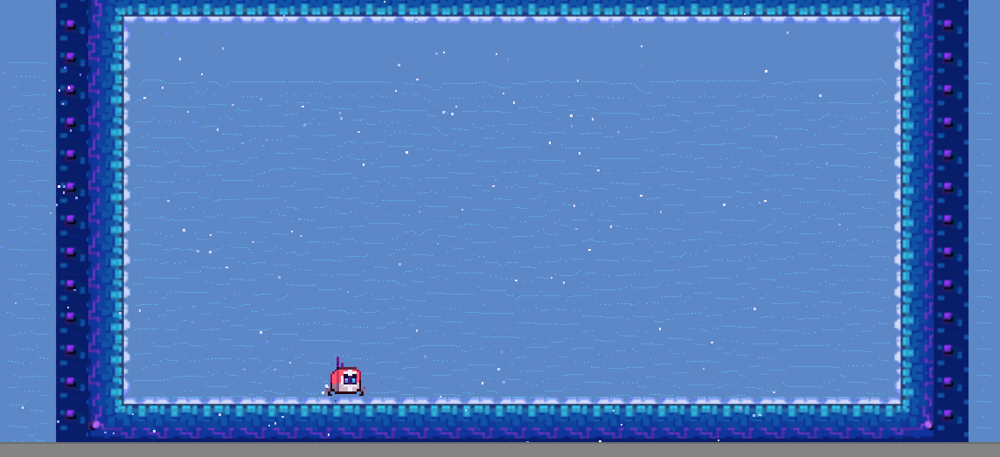
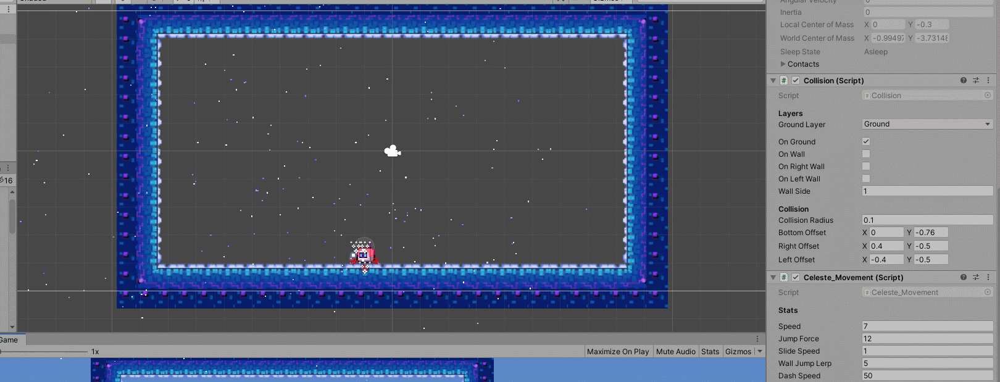
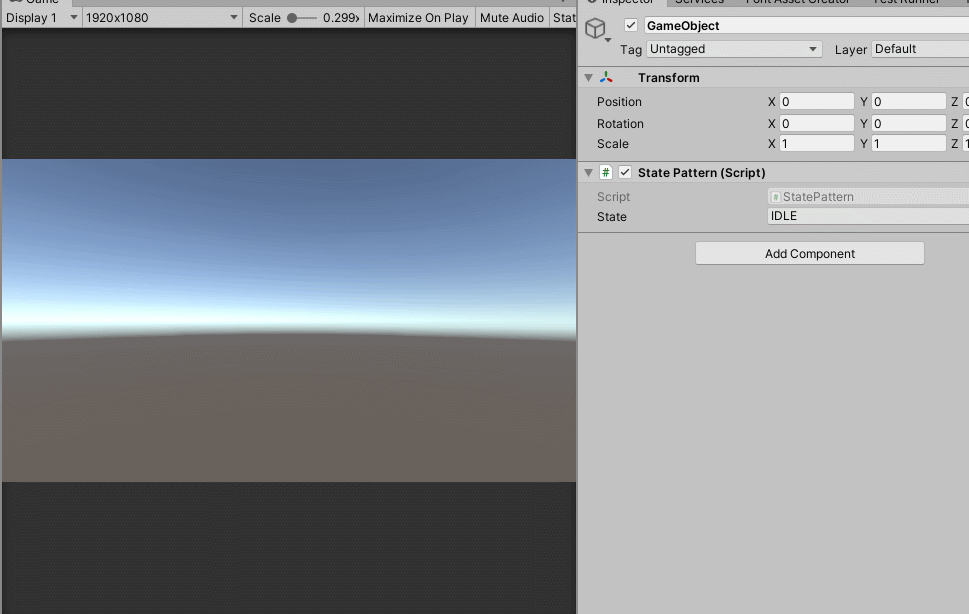

# 시현 자료

## 인디 게임인 Celeste의 움직임 구현

* 2D Platformer Game의 움직임 DOTween 라이브러리를 통한 카메라 흔들림효과
* DOTween.Sequence를 통한 Ghost Trail Effect 구현
* 내부 Physics2D Collision 감지 함수를 통한 Player의 충돌 여부 구현

### 초기화면

### 움직임

### 점프 화

### 충돌 탐지

## Parkour FPS Game

* CharacterController가 아닌 Rigidbody의 Movement를 구현하여, 보다 물리적인 움직임에 가깝고, Grappling Gun을 이용한 Rigidbody의 연결로 그래플링 움직임을 구현
* Physics2D Collision 감지 함수를 이용한 충돌 여부 탐지 기능 제작--Probuilder를 통한 맵 제작--Post processing을 적용하여 BackGround Effect 추가
*  동작 추가에 따른 관리의 어려움을 해결하기 위해 Event State 패턴 기초 구현 후 적용 예정

### 움직임 

### Grappling Gun

### 적용 예정중인 State Pattern 기초 구현

